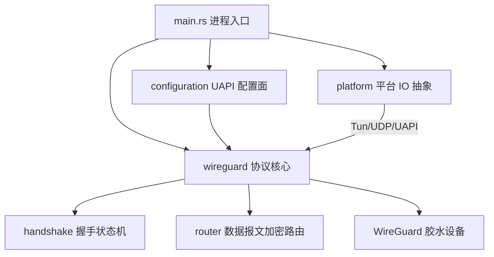
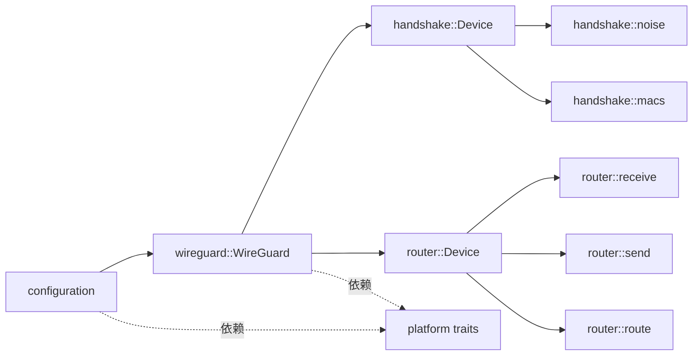
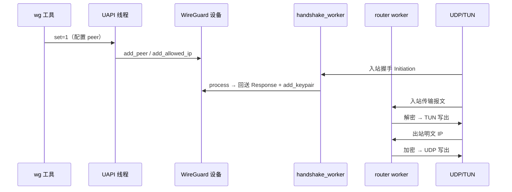

[上一篇](00-docs-style-guide.md) · [总目录](README.md) · [下一篇](02-简单例子-全路径走读.md)

# 第一层：简单框架——系统骨架

> **场景**：从零认识 wireguard-rs，回答「项目做什么？由什么组成？任务怎么流转？」
> **版本**：0.1.4
> **源码基准**：当前源码

## 1. 项目做什么

wireguard-rs 是 WireGuard VPN 协议的**纯 Rust 用户态实现**。它把一个虚拟网卡（TUN）与一组 UDP 端点之间流动的明文 IP 包，封装成经过 Noise 协议认证加密的 UDP 数据报，并在收到对端数据报时解密后写入虚拟网卡。

与 Linux 内核模块不同，它**运行在用户态**，通过 `/dev/net/tun` 与 UDP 套接字完成 IO，通过 Unix 域套接字（UAPI）与 `wg` 命令行工具通信完成配置（README.md）。

## 2. 进程 / 模块 / 组件

进程是单二进制 `wireguard-rs <dev>`，启动后常驻为守护进程（main.rs）。代码按职责分为三层：



### 2.1 顶层模块

| 模块 | 文件 | 职责 |
|---|---|---|
| `main` | `src/main.rs` | 解析参数、创建 UAPI/TUN、降权、daemonize、构造 `WireGuard`、启动工作线程 |
| `platform` | `src/platform/mod.rs` | IO 抽象：`Tun` / `UDP` / `UAPI` trait；Linux 真实现（`src/platform/linux/`）与 dummy 测试实现（`src/platform/dummy/`） |
| `configuration` | `src/configuration/mod.rs` | 把 UAPI 文本协议翻译为对 `WireGuard` 的调用；对外暴露 `Configuration` trait |
| `wireguard` | `src/wireguard/mod.rs` | 协议核心，不含具体 IO；把 handshake 与 router 粘合成一个设备 |

### 2.2 协议核心子模块

| 子模块 | 文件 | 职责 |
|---|---|---|
| `wireguard::handshake` | `src/wireguard/handshake/mod.rs` | Noise_IKpsk2 握手状态机，产出会话密钥 `KeyPair` |
| `wireguard::router` | `src/wireguard/router/mod.rs` | cryptokey 路由器，负责传输报文的加解密与路由 |
| `wireguard::WireGuard` | `src/wireguard/wireguard.rs` | 胶水结构，持有 handshake device、router device、定时器轮、tun/udp 读取线程 |
| `wireguard::PeerInner` | `src/wireguard/peer.rs` | 每个 peer 的握手侧状态（统计、握手队列标志、定时器句柄） |
| `wireguard::timers` | `src/wireguard/timers.rs` | 基于 `hjul` 定时器轮的各类 WireGuard 定时器 |
| `wireguard::workers` | `src/wireguard/workers.rs` | `tun_worker` / `udp_worker` / `handshake_worker` 三个 IO/计算线程体 |
| `wireguard::queue` | `src/wireguard/queue.rs` | `ParallelQueue`：多消费者单生产者的握手任务队列 |

## 3. 模块依赖关系



- `configuration` 依赖 `wireguard` 与 `platform`，不反向依赖。
- `wireguard` 核心**只依赖 `platform` 的 trait 抽象**（泛型 `T: Tun, B: UDP`），不依赖 Linux 实现，因此可在单测中用 dummy 实现实例化（`src/wireguard/mod.rs` Module：`wireguard` 注释）。
- `handshake` 与 `router` 互不依赖，仅通过 `WireGuard` 胶水层与共享的 `KeyPair`（`src/wireguard/types.rs` Struct：`KeyPair`）耦合。

## 4. 输入 / 输出

| 边界 | 输入 | 输出 |
|---|---|---|
| TUN（虚拟网卡） | 明文 IP 包（出站） | 解密后的明文 IP 包（入站） |
| UDP（加密通道） | 握手/传输密文数据报 | 握手/传输密文数据报 |
| UAPI（Unix 套接字） | `set=1` / `get=1` 文本指令 | `errno=0` 等文本响应 |

## 5. 主数据流

两条主线贯穿系统：**控制面（配置）** 与 **数据面（报文）**。

### 5.1 控制面（配置一个 peer）

```text
wg 工具
  → 写 UAPI Unix 套接字（set=1）
  → configuration::uapi::handle
  → LineParser::parse_line
  → Configuration::add_peer / set_endpoint / add_allowed_ip ...
  → WireGuard::add_peer
  → handshake::Device::add  +  router::PeerHandle::add_allowed_ip
```

### 5.2 数据面（出站明文 → 入站密文）

```text
TUN 读线程 tun_worker
  → router::Device::send
  → 查 cryptokey 路由得到 peer
  → Peer::send（加密作业 SendJob）
  → worker 线程并行加密 → 顺序写 → peer.send_raw
  → UDP 套接字写出
```

### 5.3 数据面（入站密文 → 明文）

```text
UDP 读线程 udp_worker
  → 按首字段 4 字节分派
  → 握手报文：handshake_worker → handshake::Device::process → 回送 + add_keypair
  → 传输报文：router::Device::recv → ReceiveJob → worker 解密 → TUN 写出
```

## 6. 整体运行流程



> 本层只建立骨架。下一层用一条真实全路径把上述组件串起来。

[上一篇](00-docs-style-guide.md) · [总目录](README.md) · [下一篇](02-简单例子-全路径走读.md)
