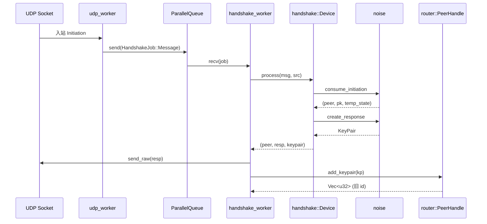

[上一篇](02-简单例子-全路径走读.md) · [总目录](README.md) · [下一篇](04-核心模块与类型关系图.md)

# 第三层：详细逐步说明——主链路拆解

> **场景**：同第二层——入站 Handshake Initiation 的响应方主链路
> **版本**：0.1.4
> **源码基准**：当前源码
> **拆解对象**：`src/wireguard/workers.rs` `udp_worker` → `handshake_worker` → `handshake::Device::process` → `noise::{consume_initiation,create_response}` → `router::PeerHandle::add_keypair`

## 0. 时序总览



## 1. udp_worker 收包与分派

**调用方**：`main.rs` 中 `thread::spawn(move || udp_worker(&wg, reader))`（main.rs 函数：`main` 偏移：`+240`）。
**被调用**：`src/wireguard/workers.rs` 函数：`udp_worker`。
1. **谁调用谁**：IO 线程循环 `loop`，每次 `reader.read(&mut msg)`。
2. **参数传递**：`msg` 预分配 `mtu + MAX_HANDSHAKE_MSG_SIZE` 字节；`reader.read` 返回 `(size, src: B::Endpoint)`。
3. **参数转换**：`msg.truncate(size)`；`mtu == 0` 则跳过（设备未 up）。
4. **函数内部**：`LittleEndian::read_u32(&msg[..])` 取 4 字节消息类型（workers.rs 函数：`udp_worker` 偏移：`+129`）。
5. **关键分支**：`TYPE_INITIATION`（=1）命中 → `wg.pending.fetch_add(1, SeqCst)`，`wg.queue.send(HandshakeJob::Message(msg, src))`（偏移：`+130 ~ +134`）。
6. **状态变化**：`wg.pending`（在途握手计数）原子 +1。
7. **错误传播**：`reader.read` 失败即 `return`，线程退出；无错误向上抛。

## 2. 入队与 under_load 判定

**调用方**：`handshake_worker` 的 `for job in rx` 循环（workers.rs 函数：`handshake_worker` 偏移：`+155`）。
1. **谁调用谁**：`handshake_worker` 从 `ParallelQueue`（crossbeam bounded channel）取 `HandshakeJob`。
2. **参数传递**：`job: HandshakeJob<B::Endpoint>`；`wg.pending.fetch_sub(1)`。
3. **状态变化**：`pending` 原子 -1。
4. **关键分支（under_load）**：若 `pending > THRESHOLD_UNDER_LOAD`（`constants.rs` Const，`= MAX_QUEUED_INCOMING_HANDSHAKES/8 = 512`），或距上次 under_load 不足 `DURATION_UNDER_LOAD`（1s），则 `under_load = true`，DoS 缓解使能（workers.rs 偏移：`+157 ~ +176`）。
5. **参数转换**：`under_load` 决定传给 `process` 的 `src` 是否 `Some` —— 只有 under_load 时才做 mac2/cookie/ratelimit 检查（偏移：`+186 ~ +190`）。

## 3. handshake::Device::process 入口

**调用方**：`handshake_worker` 偏移：`+183`。
**被调用**：`src/wireguard/handshake/device.rs` 函数：`process`（偏移：`+308`）。
1. **参数**：`rng = &mut OsRng`，`msg = &msg[..]`，`src = Some(src.into_address())`（under_load 时）。
2. **前置条件检查**：`msg.len() < 4` → `Err(InvalidMessageFormat)`（偏移：`+315`）。
3. **外部依赖**：`keyst = self.keyst.as_ref()`；若为 `None`（未设私钥）返回 `(None,None,None)` 空操作（偏移：`+321 ~ +326`）。
4. **类型分派**：`LittleEndian::read_u32(msg)` 匹配 `TYPE_INITIATION`（偏移：`+329`）。
5. **返回值约定**：`Output<'a, O> = (Option<&'a O>, Option<Vec<u8>>, Option<KeyPair>)` —— 三元组分别对应（对端 opaque、待回送报文、协商密钥）。

## 4. Initiation::parse 与 check_mac1

1. **谁调用谁**：`device.rs` 偏移：`+332` `Initiation::parse(msg)`；偏移：`+335` `keyst.macs.check_mac1(msg.noise.as_bytes(), &msg.macs)`。
2. **函数内部（parse）**：`src/wireguard/handshake/messages.rs` 函数：`Initiation::parse` → `LayoutVerified::new(bytes)` 零拷贝校验内存布局，并断言 `f_type == TYPE_INITIATION`，否则 `InvalidMessageFormat`。
3. **函数内部（check_mac1）**：`src/wireguard/handshake/macs.rs` 函数：`Validator::check_mac1` → `MAC!(&self.mac1_key, inner).ct_eq(&macs.f_mac1)` 常量时间比较；不符返回 `Err(InvalidMac1)`（macs.rs 偏移：`+264`）。
4. **数据输入**：`inner = msg.noise.as_bytes()`（不含 macs footer）；`mac1_key` 由设备公钥派生 `HASH!(b"mac1----", pk)`（macs.rs Const：`LABEL_MAC1`，偏移：`+22`）。

## 5. consume_initiation（Noise 响应方解密半程）

**被调用**：`src/wireguard/handshake/noise.rs` 函数：`consume_initiation`（偏移：`+330 ~ +404`）。
1. **参数**：`device: &'a Device<O>`，`keyst: &KeyState`，`msg: &NoiseInitiation`。
2. **函数内部**：
   - 初始化 `ck = INITIAL_CK`，`hs = HASH!(INITIAL_HS, keyst.pk)`（noise.rs Const：`INITIAL_CK`/`INITIAL_HS`）。
   - `KDF1!(ck, msg.f_ephemeral)` → 吸收对端瞬态公钥。
   - `shared_secret(keyst.sk, eph_r_pk)` 做 X25519；零共享密钥 → `InvalidSharedSecret`（noise.rs 函数：`shared_secret` 偏移：`+221`）。
   - `KDF2!` 派生 `(ck, key)`，用 `key` 解密 `msg.f_static` 得到对端 static 公钥 `pk`。
   - `device.lookup_pk(&pk)` 找到本地 peer（device.rs 函数：`lookup_pk`）。
   - 解密 `msg.f_timestamp` 得 `ts`，`peer.check_replay_flood(device, &ts)` 防重放/洪泛（peer.rs 函数：`check_replay_flood`）。
3. **返回值**：`(&'a Peer<O>, PublicKey, TemporaryState)`，其中 `TemporaryState = (receiver_id, eph_r_pk, hs, ck)`（noise.rs Type：`TemporaryState`）。
4. **状态变化**：对端 peer 的 `state` 被置为 `State::Reset`，旧的 `InitiationSent` 状态被清除（noise.rs 偏移：`+367`）。

## 6. allocate 本地 receiver id

**被调用**：`src/wireguard/handshake/device.rs` 函数：`allocate`（偏移：`+463`）。
1. **参数转换**：`rng.gen::<u32>()` 拒绝采样，确保 id 不在 `id_map`（DashMap）中（偏移：`+464 ~ +477`）。
2. **状态变化**：`id_map.insert(id, pk.as_bytes())`，把本地 receiver id 绑定到对端公钥。
3. **返回值**：`u32` 本地 id `local`，将作为回送 Response 的 `f_sender`。

## 7. create_response（派生 KeyPair）

**被调用**：`src/wireguard/handshake/noise.rs` 函数：`create_response`（偏移：`+406 ~ +488`）。
1. **谁调用谁**：`device.rs` 偏移：`+368`。
2. **参数**：`rng, peer, pk, local, state: TemporaryState, msg: &mut NoiseResponse`。
3. **函数内部**：
   - 解包 `state` → `(receiver, eph_r_pk, hs, ck)`。
   - 生成响应方瞬态密钥 `eph_sk/eph_pk`；`KDF1!(ck, eph_pk)` 吸收。
   - `KDF1!(ck, DH(eph_sk, eph_r_pk))`、`KDF1!(ck, DH(eph_sk, pk))` 两次吸收 DH。
   - `KDF3!(ck, peer.psk)` → `(ck, tau, key)`；用 `key` 以空明文 AEAD 密封 `msg.f_empty`（PSK 绑定）。
   - 最终 `KDF2!(ck, &[])` 派生 `(key_recv, key_send)`。
4. **返回值**：`KeyPair { birth, initiator:false, send:{id:receiver,key:key_send}, recv:{id:local,key:key_recv} }`。
   - 注意：`send.id = receiver`（对端 sender id，本端发往对端用），`recv.id = local`（本端刚 allocate 的 id）。
5. **数据处理**：`msg.f_type=2`，`msg.f_sender=local`，`msg.f_receiver=receiver` 在偏移：`+420 ~ +422` 写入。

## 8. generate macs

**被调用**：`src/wireguard/handshake/macs.rs` 函数：`Generator::generate`（device.rs 偏移：`+375`）。
1. **参数**：`inner = resp.noise.as_bytes()`，`macs = &mut resp.macs`。
2. **函数内部**：`f_mac1 = MAC!(mac1_key, inner)`；若已有 cookie，则 `f_mac2 = MAC!(cookie, inner, mac1)` 否则清零（macs.rs 偏移：`+165 ~ +179`）。
3. **状态变化**：`self.last_mac1 = Some(f_mac1)`，供后续 cookie reply 处理比对。

## 9. 回送 Response 与状态/timer 更新

**回到** `handshake_worker` 偏移：`+192 ~ +245`。
1. **回送**：`resp` 为 `Some` → `wg.router.send_raw(&msg[..], &mut src)`（`router/device.rs` 函数：`send_raw` 用于 DeviceHandle），经 UDP 写出 Response。
2. **参数转换**：`resp_len = msg.len() as u64`。
3. **状态变化**：
   - `peer.opaque().rx_bytes.fetch_add(req_len)`、`tx_bytes.fetch_add(resp_len)` 更新统计。
   - `peer.set_endpoint(src)` 记录对端地址。
   - `resp_len > 0` → `peer.opaque().sent_handshake_response()` 触发定时器（timers.rs 函数：`sent_handshake_response`）。
4. **错误传播**：`send_raw` 失败仅 `debug!` 记录，不中断。

## 10. add_keypair 注册密钥

**调用方**：`handshake_worker` 偏移：`+234 ~ +244`（`peer.add_keypair(kp)`，循环 `device.release(id)`）。
**被调用**：`src/wireguard/router/peer.rs` 函数：`add_keypair`（偏移：`+436`）。
1. **参数**：`new: KeyPair`（`initiator=false`）→ 返回 `Vec<u32>` 待释放 id。
2. **关键分支**：因 `initiator == false`：
   - `keys.previous = keys.next`（旧 next 退休）；
   - `keys.next = Some(new)`（存入待确认态）（peer.rs 偏移：`+453 ~ +457`）。
3. **外部依赖**：写入 `device.recv` 映射：`recv.insert(new.recv.id, DecryptionState::new(peer, &new))`（peer.rs 偏移：`+460 ~ +476`），使后续 `router::Device::recv` 能按 receiver id 定位解密状态。
4. **状态变化**：purge 旧 `previous` id 并加入 `release` 列表返回上层。
5. **返回值**：`Vec<u32>` → `handshake_worker` 调 `device.release(id)` 把对应本地 id 从 `id_map` 释放（device.rs 函数：`release` 偏移：`+268`）。

## 11. 链路收尾与数据流小结

```text
UDP 入站 Initiation
  → udp_worker（计数 + 分派）
  → ParallelQueue（握手任务缓冲）
  → handshake_worker（under_load 判定 + 驱动）
  → handshake::Device::process（类型分派 + mac 校验）
  → noise::consume_initiation（解密对端 static + 时间戳反重放）
  → allocate（分配本地 receiver id）
  → noise::create_response（派生 KeyPair，initiator=false）
  → macs::generate（mac1/mac2）
  → send_raw（回送 Response）
  → router::add_keypair（注册 DecryptionState 到 recv 映射）
UDP 出站 Response
```

**数据流**：`Vec<u8>` 密文 → `&[u8]` → `NoiseInitiation`（零拷贝）→ `KeyPair`（派生）→ `NoiseResponse`（就地构造）→ `Vec<u8>` 回送；`KeyPair` 经 `add_keypair` 注入 router 的 `recv` 映射与 `KeyWheel`。

**状态变化要点**：handshake 侧 `peer.state` 被复位；router 侧新增一条 `DecryptionState`；`wg.pending` 归零；对端 endpoint 已记录；密钥处于 `keys.next`（待对端确认）。

> 第四层将逐函数展开上述每个符号的实现细节（05 handshake 模块、06 router 模块）。

[上一篇](02-简单例子-全路径走读.md) · [总目录](README.md) · [下一篇](04-核心模块与类型关系图.md)
