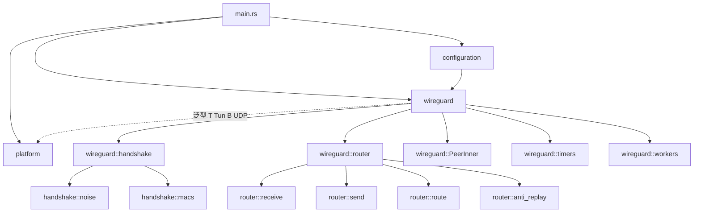

[上一篇](03-详细逐步说明-主链路拆解.md) · [总目录](README.md) · [下一篇](05-handshake模块函数级解析.md)

# 第四层：核心模块与类型关系图

> **版本**：0.1.4
> **源码基准**：当前源码
> **定位**：本篇是第四层的「关系总览」，给出模块 / 类型 / trait 之间的连接；具体函数实现见 05~10。

## 1. 模块依赖关系（Mermaid）



## 2. 核心类型关系（Mermaid）

```mermaid
classDiagram
    class WireGuard~T,B~ { +Arc~WireguardInner~ inner }
    class WireguardInner~T,B~ { peers: handshake::Device router: router::Device runner: hjul::Runner queue: ParallelQueue }
    class PeerInner~T,B~ { pk wg timers rx_bytes tx_bytes }
    class handshake::Device~O~ { keyst: KeyState pk_map: HashMap id_map: DashMap }
    class handshake::Peer~O~ { opaque state ss psk macs }
    class router::Device~E,C,T,B~ { inbound outbound recv: HashMap table: RoutingTable }
    class router::PeerHandle~E,C,T,B~ { peer: Peer }
    class KeyPair { send: Key recv: Key initiator birth }
    class Key { key: [u8;32] id: u32 }
    WireGuard --> WireguardInner
    WireguardInner *-- handshake::Device
    WireguardInner *-- router::Device
    PeerInner ..> handshake::Peer : opaque=O
    PeerInner ..> router::PeerHandle : Opaque
    handshake::Device o-- handshake::Peer
    router::Device o-- router::PeerHandle
    handshake::Device ..> KeyPair : process 产出
    router::PeerHandle ..> KeyPair : add_keypair 消费
```

## 3. 关键 Trait 与实现

| Trait | 文件 | 实现（Linux） | 说明 |
|---|---|---|---|
| `Tun` / `PlatformTun` | `src/platform/tun.rs` | `LinuxTun`（`src/platform/linux/tun.rs`） | 虚拟网卡读/写/状态 |
| `UDP` / `PlatformUDP` | `src/platform/udp.rs` | `LinuxUDP`（`src/platform/linux/udp.rs`） | UDP 读/写/绑定 |
| `UAPI` / `PlatformUAPI` | `src/platform/uapi.rs` | `LinuxUAPI`（`src/platform/linux/uapi.rs`） | Unix 套接字监听 |
| `Endpoint` | `src/platform/endpoint.rs` | `LinuxEndpoint` | 地址 ↔ 底层 sockaddr 转换 |
| `Configuration` | `src/configuration/config.rs` | `WireGuardConfig` | 配置面对外接口 |
| `Callbacks` | `src/wireguard/router/types.rs` | `PeerInner`（`src/wireguard/timers.rs` 末尾 `impl Callbacks for PeerInner`） | 路由加解密回调（计时器/统计） |
| `SequentialJob` / `ParallelJob` | `src/wireguard/router/queue.rs` | `SendJob` / `ReceiveJob` | 顺序+并行两段式作业 |

## 4. 泛型参数约定

贯穿全代码的四个泛型参数：
- `T: Tun` —— TUN 实现类型（如 `LinuxTun`）。
- `B: UDP` —— UDP 实现类型（如 `LinuxUDP`）。
- `E: Endpoint` —— 端点类型（如 `LinuxEndpoint`）。
- `C: Callbacks` —— 路由回调宿主类型，在 wireguard 核心中固定为 `PeerInner<T, B>`（`router/types.rs` Trait：`Callbacks`，`Opaque = Self`）。

## 5. 分层职责速查

| 层 | 入口 | 出口 | 核心结构 |
|---|---|---|---|
| 握手 | `udp_worker` → `handshake_worker` → `Device::process` | `send_raw`（Response）+ `add_keypair` | `handshake::Device` / `noise` / `macs` |
| 路由（出） | `tun_worker` → `Device::send` → `Peer::send` | `SendJob` → `send_raw` | `RoutingTable` / `KeyWheel` / `SendJob` |
| 路由（入） | `udp_worker`（TYPE_TRANSPORT）→ `Device::recv` | `ReceiveJob` → TUN 写 | `recv` 映射 / `DecryptionState` / `AntiReplay` |
| 配置 | `uapi::handle` → `LineParser` | `Configuration` 方法 | `WireGuardConfig` / `WireGuard` |
| 计时 | `hjul::Runner` 定时器回调 | `PeerInner` 各 `packet_*` 方法 | `Timers` / `KeyWheel` |

## 6. 文档地图（第四层其余篇章）

- `05-handshake模块函数级解析.md`：`handshake::Device` / `noise` / `Peer` / `messages` / `macs` / `ratelimiter` / `timestamp` 函数级。
- `06-router模块函数级解析.md`：`router::Device` / `PeerHandle` / `receive` / `send` / `route` / `worker` / `queue` / `anti_replay` / `ip` / `messages` 函数级。
- `07-配置与UAPI函数级解析.md`：`Configuration` trait / `WireGuardConfig` / `uapi::handle` / `LineParser` / `get::serialize` / `ConfigError`。
- `08-平台IO与启动并发模型.md`：`main` / platform traits / `LinuxUDP` / `LinuxTun` / `LinuxUAPI` / `util`。
- `09-定时器与密钥生命周期.md`：`Timers` / `KeyWheel` / `add_keypair` / `confirm_key` / 密钥轮换与清零。
- `10-测试dummy平台与可复现性.md`：tests 模块、dummy 平台、编译与运行。

> 本篇仅给关系，不展开函数体。下一层起逐函数解析。

[上一篇](03-详细逐步说明-主链路拆解.md) · [总目录](README.md) · [下一篇](05-handshake模块函数级解析.md)
