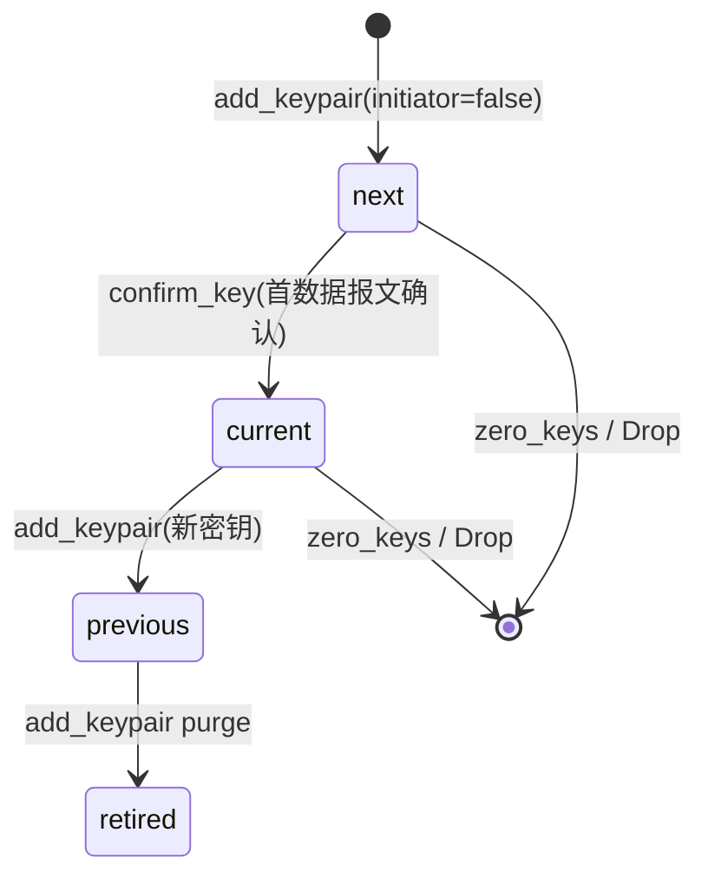

[上一篇](08-平台IO与启动并发模型.md) · [总目录](README.md) · [下一篇](10-测试dummy平台与可复现性.md)

# 第四层：定时器与密钥生命周期

> **版本**：0.1.4
> **源码基准**：当前源码
> **范围**：`src/wireguard/timers.rs`、`src/wireguard/router/peer.rs`（KeyWheel / add_keypair / confirm_key / zero_keys）、`src/wireguard/constants.rs`

## 1. 设计意图

WireGuard 用一组语义定时器维护「密钥新鲜度、握手重传、保活、密钥清零」，全部挂在 `hjul` 定时器轮上。每个 peer 一个 `Timers` 实例，由 `WireGuard::new` 时构造的 `Runner`（wireguard.rs 偏移：`+290`，`TIMERS_TICK=100ms`/`TIMERS_SLOTS`/`TIMERS_CAPACITY`）驱动（constants.rs Const：`TIMERS_*`）。

---

## 2. timers.rs —— 定时器

### 2.1 类型

**Struct：`Timers`**（timers.rs 结构：`Timers`）：
- 配置期字段：`enabled:bool`、`keepalive_interval:u64`。
- 状态：`handshake_attempts:AtomicUsize`、`sent_lastminute_handshake:AtomicBool`、`need_another_keepalive:AtomicBool`。
- 五个 `hjul::Timer`：`retransmit_handshake` / `send_keepalive` / `send_persistent_keepalive` / `zero_key_material` / `new_handshake`。

### 2.2 函数：`new`（注册五个定时器回调）

**源码**：timers.rs 函数：`new`（偏移：`+234 ~ +362`）
**参数**：`wg:WireGuard<T,B>`、`pk:PublicKey`、`running:bool`。
**关键**：`runner = wg.runner.lock()` 后为每个 Timer 注册闭包；闭包内用 `fetch_peer!` / `fetch_timers!` 宏按 pk 取 peer 并校验 `enabled`（timers.rs 宏：`fetch_peer!` 偏移：`+239`、`fetch_timers!` 偏移：`+251`）。

**五个回调语义**：
1. `retransmit_handshake`（偏移：`+269`）：取 `handshake_attempts.fetch_add(1)`；若 `>MAX_TIMER_HANDSHAKES` → 放弃（`send_keepalive.stop` + `zero_key_material.start` + `purge_staged_packets`）；否则 `retransmit_handshake.reset(REKEY_TIMEOUT)` + `clear_src` + `packet_send_queued_handshake_initiation(true)`（重试）。
2. `send_keepalive`（偏移：`+300`）：`peer.send_keepalive()`；若 `need_another_keepalive()` 则再 `start(KEEPALIVE_TIMEOUT)`。
3. `new_handshake`（偏移：`+314`）：`clear_src` + `packet_send_queued_handshake_initiation(false)`（长时间无回包后重新握手）。
4. `zero_key_material`（偏移：`+331`）：`peer.zero_keys()`（密钥过期清零）。
5. `send_persistent_keepalive`（偏移：`+342`）：`keepalive_interval>0` 时停普通 keepalive、发 keepalive 并 `start(interval)` 周期重排。

### 2.3 启停与事件方法

| 方法 | 偏移 | 作用 |
|---|---|---|
| `start_timers` | `+71` | 置 `enabled=true`；`keepalive_interval>0` 则立即 `start` 持久保活 |
| `stop_timers` | `+46` | 置 `enabled=false`，停全部定时器并复位状态 |
| `timers_data_sent` | `+90` | 发数据后 `new_handshake.start(KEEPALIVE_TIMEOUT+REKEY_TIMEOUT)` |
| `timers_data_received` | `+100` | 收数据后 `send_keepalive.start(KEEPALIVE_TIMEOUT)`（或置 `need_another_keepalive`） |
| `timers_any_authenticated_packet_sent` | `+112` | 停 `send_keepalive` |
| `timers_any_authenticated_packet_received` | `+125` | 停 `new_handshake` |
| `timers_handshake_initiated` | `+134` | 停 keepalive + `retransmit_handshake.reset(REKEY_TIMEOUT)` |
| `timers_handshake_complete` | `+146` | 停重传、清 `handshake_attempts`、记 `walltime_last_handshake` |
| `timers_session_derived` | `+162` | `zero_key_material.reset(REJECT_AFTER_TIME*3)` |
| `timers_any_authenticated_packet_traversal` | `+173` | `keepalive_interval>0` 时推迟持久保活 |
| `sent_handshake_initiation` | `+194` | 记录时间 + 调上述多个 timers_*（发起握手时） |
| `sent_handshake_response` | `+202` | 遍历/保活计时更新（响应握手时） |
| `set_persistent_keepalive_interval` | `+208` | 更新 `keepalive_interval` 并重置持久保活定时器 |
| `packet_send_queued_handshake_initiation` | `+225` | 委托 `PeerInner::packet_send_handshake_initiation`（peer.rs） |

---

## 3. impl Callbacks for PeerInner（路由回调驱动计时器）

**源码**：timers.rs `impl Callbacks for PeerInner`（偏移：`+365 ~ +450`）
`Opaque = Self`；四个回调在路由加解密完成时被 `send.rs`/`receive.rs` 调用。

### 3.1 `send`（偏移：`+372`）

**内部 `keep_key_fresh`**（嵌套，偏移：`+386`）：`counter > REKEY_AFTER_MESSAGES`（=`1<<60`）或（`initiator` 且 `now-birth > REKEY_AFTER_TIME`(120s)）→ 触发 `packet_send_queued_handshake_initiation(false)`。
**执行流程**：更新 `tx_bytes`；`size>message_data_len(0) && sent` → `timers_data_sent`；始终 `timers_any_authenticated_packet_traversal` + `timers_any_authenticated_packet_sent`。

### 3.2 `recv`（偏移：`+404`）

**内部 `keep_key_fresh`**（偏移：`+419`）：`now-birth > REJECT_AFTER_TIME - KEEPALIVE_TIMEOUT - REKEY_TIMEOUT` 且 `sent_lastminute_handshake` CAS 成功 → 触发新握手。
**执行流程**：更新 `rx_bytes`；`size>0 && sent` → `timers_data_received`；始终 `timers_any_authenticated_packet_traversal` + `timers_any_authenticated_packet_received`。

### 3.3 `need_key`（偏移：`+440`）

无可用密钥时每次加密尝试都会调用 → `packet_send_queued_handshake_initiation(false)`（请求新握手）。

### 3.4 `key_confirmed`（偏移：`+446`）

密钥被确认时 → `timers_handshake_complete()`。

---

## 4. 密钥生命周期（KeyWheel）

**Struct：`KeyWheel`**（router/peer.rs 结构：`KeyWheel`）：三槽 `next/current/previous: Option<Arc<KeyPair>>` + `retired:Vec<u32>`。

### 4.1 流转图



### 4.2 关键函数（router/peer.rs）

- `add_keypair`（偏移：`+436`）：`initiator=true` → 立即 `enc_key=EncryptionState` 并 `current=Some(new)`（发起方）；`initiator=false` → `next=Some(new)`（响应方待确认）。写 `recv[new.recv.id]=DecryptionState`，purge 旧 `previous.id`。
- `confirm_key`（偏移：`+316`）：`next` 与传入 `keypair` `ptr_eq` 校验 → swap `next→current→previous` → `enc_key=EncryptionState::new(next)` → `C::key_confirmed` → `send_staged()`。
- `zero_keys`（偏移：`+383`）：把 `next/current/previous` 移入 `retired`、清 `recv` 映射、置 `enc_key=None`（`PeerHandle::down` / 定时器 `zero_key_material` 调用）。
- `Drop for PeerHandle`（偏移：`+144`）：从 `table` 与 `recv` 移除并清零所有密钥材料。

### 4.3 常量语义（constants.rs）

| 常量 | 值 | 含义 |
|---|---|---|
| `REKEY_AFTER_TIME` | 120s | 发起方密钥使用超此时长触发重协商 |
| `REJECT_AFTER_TIME` | 180s | 密钥最大存活，超时清零 |
| `REKEY_ATTEMPT_TIME` | 90s | 握手重传窗口 |
| `REKEY_TIMEOUT` | 5s | 单次握手重传间隔 |
| `KEEPALIVE_TIMEOUT` | 10s | 保活间隔 |
| `REKEY_AFTER_MESSAGES` | `1<<60` | 发送计数阈值触发重协商 |
| `REJECT_AFTER_MESSAGES` | `u64::MAX-(1<<4)` | 计数器拒绝阈值 |
| `MAX_TIMER_HANDSHAKES` | `REKEY_ATTEMPT_TIME/REKEY_TIMEOUT=18` | 重试上限后放弃 |

---

## 5. 端到端密钥时间线（示例）

```text
t0  add_keypair(initiator=false)         → next 待确认；recv[recv.id] 可解密
t1  对端发首传输报文 → ReceiveJob::sequential_work
      → confirmed.swap(true) → confirm_key → current 转正；本端可发加密
t2  发送 REKEY_AFTER_MESSAGES 或 >120s  → Callbacks::send keep_key_fresh → 发起新握手
t3  新 add_keypair → previous=旧current；旧 id 进 retired
t4  REJECT_AFTER_TIME*3 后 zero_key_material 定时器 → zero_keys 清零旧密钥
```

> 测试、dummy 平台与编译运行见 `10`。

[上一篇](08-平台IO与启动并发模型.md) · [总目录](README.md) · [下一篇](10-测试dummy平台与可复现性.md)
