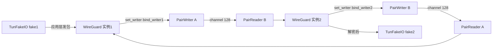

[上一篇](09-定时器与密钥生命周期.md) · [总目录](README.md)

# 10 · 测试、dummy 平台与可复现性

> **定位**：本篇是第四层（函数级）收尾。前三篇（05 握手 / 06 路由 / 07 配置 / 08 平台IO / 09 定时器）讲「真实平台怎么跑」，本篇讲「没有真实网络时怎么测」以及「怎么在你机器上复现」。
> **关键结论**：wireguard-rs 的核心逻辑（`WireGuard<T,B>` / `handshake::Device` / `router::Device`）完全泛化在 `T: Tun`、`B: UDP` 之上，因此项目内置了一个 **dummy 平台**，用进程内 channel 把两个 WG 实例「接上线」，从而在 `#[test]` 里跑通完整握手与加密传输、**不依赖 root / 真网卡 / 真 UDP socket**。

## 1. dummy 平台总览

```text
Module：dummy  (文件：src/platform/dummy/mod.rs)
├─ endpoint.rs  → UnitEndpoint      (Endpoint 的空实现)
├─ tun/mod.rs   → TunError 枚举
│  ├─ tun/dummy.rs → TunTest / TunFakeIO / TunReader / TunWriter / TunStatus  (可用、被测试使用)
│  └─ tun/void.rs  → VoidTun  (整段被 /* */ 注释掉，未编译)
└─ udp.rs       → VoidBind (空实现) / PairBind (双实例互联)  (UDP 实现)
```

`src/platform/dummy/mod.rs` 顶部注释原文：
> "A pure dummy platform available during 'test-time' ... enable unit testing of full WireGuard, the configuration interface and the UAPI parser."

即 dummy 平台的唯一目的就是让 `WireGuard`、配置接口、`uapi` 解析器能在单元测试里被完整驱动。

## 2. Endpoint 空实现

`src/platform/dummy/endpoint.rs` Struct：`UnitEndpoint`（+5）
```rust
#[derive(Clone, Copy)]
pub struct UnitEndpoint {}
```
- `impl Endpoint for UnitEndpoint`：
  - `from_address` 偏移：`+9 ~ +11` → 丢弃地址，返回 `UnitEndpoint{}`
  - `into_address` 偏移：`+13 ~ +15` → 恒返回 `"127.0.0.1:8080".parse().unwrap()`（所以所有 peer 端点都「长一样」，dummy 不计较地址）
  - `clear_src` 偏移：`+17` → 空操作（真 Linux 实现会清源地址以防御反射攻击）
- `UnitEndpoint::new` 偏移：`+21 ~ +23`

> 因为 `into_address` 永远返回同一个地址，dummy 场景下「roaming / 学习对端 endpoint」靠的是 `router::PeerHandle::set_endpoint` + 握手/确认报文携带的 `from`，而不是 `UnitEndpoint` 里存的值。

## 3. TUN 的进程内实现（可用）

`src/platform/dummy/tun/dummy.rs` 用 `std::sync::mpsc::sync_channel` 在测试进程内搭一条「假网卡」。

核心类型：
- Struct：`TunTest`（+25）→ 标记性的 TUN 实现，本身不含状态
- Struct：`TunFakeIO`（+30）→ 代表「对端 / OS 侧」，持有 `tx: SyncSender<Vec<u8>>` 与 `rx: Receiver<Vec<u8>>`，测试代码用它 `write`/`read` 来模拟「应用层发包 / 收包」
- Struct：`TunReader`（+37）→ `impl Reader` 的一端（`rx`）
- Struct：`TunWriter`（+42）→ `impl Writer` 的一端（`tx` + `store` 标志）
- Struct：`TunStatus`（+66）→ 产生 `TunEvent`，`first` 标志控制首次 `Up`

`impl Reader for TunReader`：`read` 偏移：`+89 ~ +104`
```text
rx.recv() 阻塞取一帧 → 拷到 buf[offset..] → 返回字节数
通道断开 → Err(TunError::Disconnected)
```

`impl Writer for TunWriter`：`write` 偏移：`+110 ~ +126`
```text
若 self.store：把 src 拷出，tx.send → 成功 Ok(()) / 断开 Err
否则：直接 Ok(())  （不存，用于只测「能否写出」的场景）
```

`impl Status for TunStatus`：`event` 偏移：`+132 ~ +141`
```text
first 次：first=false 并返回 TunEvent::Up(1420)  (MTU=1420)
之后：loop sleep(1 小时) 永久阻塞（模拟网卡无后续事件）
```

`impl Tun for TunTest` 偏移：`+144 ~ +148` → 关联 `Writer=TunWriter`、`Reader=TunReader`、`Error=TunError`

`TunFakeIO::write` 偏移：`+151 ~ +154` / `read` 偏移：`+157 ~ +159` → 测试侧用，仅当 `store` 时真收发

`TunTest::create(store)` 偏移：`+163 ~ +191` → 构造一对 `sync_channel`（store?32:1 容量），随机 `id`，返回 `(TunFakeIO, TunReader, TunWriter, TunStatus)`

`impl PlatformTun for TunTest`：`create` 偏移：`+197 ~ +199` → **直接 `Err(TunError::Disconnected)`**。说明真平台上 `Tun::create(name)` 走 OS，而 dummy 的「创建」不走这条路——测试直接调用 `TunTest::create` 拿到 `(reader, writer)`，再 `WireGuard::new(writer)` + `add_tun_reader(reader)`（见 `test_pure_wireguard`）。

> `src/platform/dummy/tun/void.rs` 里的 `VoidTun` 整体被 `/* ... */` 注释（文件第一行就是 `/*`）。其注释说「用于 benchmark / profiling 入站路径，write 立即丢弃、read 永不返回」。当前源码中它被注释，未参与编译——本篇不展开其内部，避免臆测。

## 4. UDP 的两种 dummy 实现

`src/platform/dummy/udp.rs` 提供两套 `UDP` 实现：

### 4.1 VoidBind（空实现，用于只测「能否写出」）
Struct：`VoidBind`（+44）
- `impl Reader<UnitEndpoint> for VoidBind`：`read` 偏移：`+46 ~ +52` → 永远 `Ok((0, UnitEndpoint{}))`（不返回任何真数据）
- `impl Writer<UnitEndpoint> for VoidBind`：`write` 偏移：`+54 ~ +60` → 永远 `Ok(())`（丢弃）
- `impl UDP for VoidBind` 偏移：`+62 ~ +68` → `Reader=VoidBind`、`Writer=VoidBind`、`Endpoint=UnitEndpoint`
- `VoidOwner` 偏移：`+18` / `impl Owner for VoidOwner` 偏移：`+179 ~ +189` → `set_fwmark` 恒 `Ok`、`get_port` 返回 `0`

`test_outbound` 里 `router.set_outbound_writer(dummy::VoidBind::new())` 即用此实现：只验证路由/加密是否「被调用」，不校验真实发出去的字节。

### 4.2 PairBind（把两个实例「接上线」）
Struct：`PairBind`（+131）；`PairReader<E>`（+79）、`PairWriter<E>`（+124）持有 `Arc<Mutex<Receiver/ SyncSender<Vec<u8>>>>`
- `PairBind::pair::<E>()` 偏移：`+134 ~ +169` → 建两条 `sync_channel(128)`，返回 `(bindA, bindB)`，且 **A 的发送端接到 B 的接收端、B 的发送端接到 A 的接收端**（交叉互联），模拟「公网」
- `impl Reader for PairReader`：`read` 偏移：`+85 ~ +103` → 从 `recv` 取一帧，`copy_from_slice` 到 `buf`，返回 `(len, UnitEndpoint{})`
- `impl Writer for PairWriter`：`write` 偏移：`+106 ~ +120` → 把 `buf` 拷出，`send` 到对端 channel
- `impl UDP for PairBind` 偏移：`+172 ~ +177` → `Reader=PairReader<UnitEndpoint>`、`Writer=PairWriter<UnitEndpoint>`
- `impl PlatformUDP for PairBind`：`bind` 偏移：`+193 ~ +196` → 同样直接 `Err(BindError::Disconnected)`（真 `bind` 由 OS 完成，dummy 走 `pair`）



> 上图就是 `test_pure_wireguard` 与 `test_bidirectional` 的拓扑：`PairBind::pair` 给两端各一个 `bind_reader/bind_writer`，交叉互联；`TunFakeIO` 模拟宿主机网卡。两端配置互补的 allowed-ip 子网即可「跨公网」互通。

## 5. 三个测试套件

### 5.1 src/wireguard/tests.rs —— 全栈端到端
- `make_packet(size, src, dst, id)` 偏移：`+15 ~ +56` → 用 `ChaCha8Rng::seed_from_u64(id)` 造伪随机负载，套一层 IPv4/IPv6 头（`pnet` crate），返回完整「IP 报文」
- `init` 偏移：`+58 ~ +60` → `env_logger` 测试模式初始化
- `test_pure_wireguard` 偏移：`+71 ~ +200` → 核心集成测试：
  1. 建两个 dummy TUN（`TunTest::create(true)`）→ `WireGuard::new(writer)` + `add_tun_reader` + `up(1500)`
  2. `PairBind::pair()` 互联，互设 `set_writer` / `add_udp_reader`
  3. 固定私钥 `sk1/sk2`（源码里写死的 32 字节数组）→ `add_peer` + `set_key`
  4. cryptokey routing：peer1 允许 `192.168.1.0/24`、peer2 允许 `192.168.2.0/24`，peer2 `set_endpoint(UnitEndpoint::new())`
  5. `num_packets=20`，方向 1→2 发 `make_packet`，方向 2→1 再发一轮
  6. 断言：对端 `fake2.read()` 收到的字节与原文 `hex::encode` 完全一致（「未修改、按序」）

> 该测试覆盖：握手自动触发、≤MTU 报文全交付、按序交付。这正是第二层「最小可运行成功场景」在测试里的真实存在形式。

### 5.2 src/wireguard/handshake/tests.rs —— 握手状态机
- `setup_devices(rng1,rng2,rng3)` 偏移：`+17 ~ +50` → 生成 `sk1/sk2`、随机 `psk`，两个 `handshake::Device::<O>` 互 `set_sk`/`add`/`set_psk`
- `wait` 偏移：`+52 ~ +54` → `sleep(20ms)`，绕开 `check_replay_flood` 的 flood 检测
- `handshake_under_load` 偏移：`+66 ~ +142` → 跑「最长 7 报文握手交互」（initiation → cookie reply → initiation → response → cookie reply → initiation → response），验证即便中间插入 cookie 风暴，最终也能协商出对称密钥对，且 `kp1.send==kp2.recv`、`kp1.recv==kp2.send`
- `handshake_no_load` 偏移：`+144 ~ +203` → 循环 10 次「begin → process(initiation) → process(response)」，校验 `ks_r.initiator==false`（响应方未确认）、`ks_i.initiator==true`（发起方已确认），并 `release` 回收 slot

> 注意：`handshake::Device::<O>` 的泛型 `O` 在测试里用 `usize`（默认），真实运行用 `router::Peer`（见 05 篇）。说明握手模块完全不依赖路由层，可独立测。

### 5.3 src/wireguard/router/tests/ —— 路由 + 加密 + 双向
`mod.rs` 偏移：`+1 ~ +48`：
- `init` 偏移：`+14 ~ +16`
- `pad(msg)` 偏移：`+18 ~ +22` → 在报文前填 `SIZE_MESSAGE_PREFIX` 字节零，预留传输层消息头位置（in-place 构造）
- `dummy_keypair(initiator)` 偏移：`+24 ~ +48` → 造一对写死的 `Key`（id `0x646e6573` / `0x76636572`），用于「不跑真握手、直接给 peer 一个密钥」的场景

`tests.rs`：
- Struct：`EventTracker<E>`（+21）→ 用 `channel` 记录事件，供断言「期望/不期望某事件」
- Struct：`Inner`（+53）/ `Opaque`（+60）→ 四个 tracker：`send`/`recv`/`need_key`/`key_confirmed`
- `impl Callbacks for TestCallbacks` 偏移：`+101 ~ +119` → 把路由层回调转成事件记录（这是 `router::Device` 要求的 `Callbacks` trait 在测试里的落地，对应真实运行的 `peer.rs` 回调）
- `test_outbound` 偏移：`+121 ~ +243` → 表驱动：多组 `mask/len/dst/okay`，配合「是否 set_key」「是否用暂存报文确认」组合，断言 cryptokey 路由查表、need_key 触发、keepalive 先于载荷、加密后尺寸 = `SIZE_KEEPALIVE + msg.len()`，最后 `no_events!` 校验无多余事件
- `test_bidirectional` 偏移：`+245 ~ +482` → 用 `PairBind` 把两个 `router::Device` 真连起来，覆盖：staged packet 触发 need_key、加 keypair 后发确认报文、对端 `recv` 确认报文后 `key_confirmed` 且**学会对端 endpoint（roaming）**、再双向发 0~`MAX_SIZE_BODY` 随机尺寸报文，逐包断言 `send`/`recv` 事件与解密成功

`bench.rs`：
- Struct：`TransmissionCounter`（+22）/ `impl Callbacks for BencherCallbacks` 偏移：`+53 ~ +65` → 用 `AtomicUsize` 统计收发字节
- `bench_router_outbound` 偏移：`+93 ~ +130+`（仅读到前部）→ 在 `#[cfg(feature="unstable")]` 下用 `#[bench]`，模拟「10GB/迭代、每包 1440 字节」的出站吞吐基准；后续循环、入站方向、profiler 钩子（`bench.rs` 偏移：`+131/+145/+423/+434`）**当前仅读到函数前部，未逐行读完**，不展开细节
- profiler 钩子 `profiler_start/stop` 偏移：`+67 ~ +91`（均 `#[cfg(feature="profiler")]`）

## 6. 可复现性：构建 / 测试命令

依赖与版本见 `Cargo.toml`（`[dependencies]` / `[features]` / `[dev-dependencies]`）。关键 feature 与实际引用点：

| feature | 作用 | 源码引用点 |
|---|---|---|
| `unstable` | 启用 `#![feature(test)]` 与 `#[bench]`（nightly 才编译 bench） | `src/main.rs:1`、`router/tests/{tests,bench}.rs` 的 `#[cfg(feature="unstable")]` |
| `profiler` | 接入 `cpuprofiler` 做 CPU 火焰图；`main.rs` 里 `#[cfg(not(feature="profiler"))]` 才有真正的 `main` | `src/main.rs:5/8/29/35/38/127`、`bench.rs:67/70/76/131/145/423/434` |
| `start_up` | 仅影响 Linux TUN 创建时的某段启动逻辑 | `src/platform/linux/tun.rs:301`（`#[cfg(feature="start_up")]`）；**该段具体做什么当前源码仅定位到一处 cfg，未展开，不臆测** |

复现命令（在仓库根目录执行）：
```bash
# 默认特性：跑全部 #[test]（含 test_pure_wireguard / handshake_* / test_outbound / test_bidirectional）
cargo test

# 只看握手测试
cargo test --test ...            # (注：测试在 lib 内嵌模块，用 `cargo test handshake` 按名过滤)

# 基准（需要 nightly 工具链，且开启 unstable）
cargo +nightly test --features unstable --bench ...   # bench 在 router/tests/bench.rs

# 带 CPU profiler 构建（仅用于 profile，无真实 main）
cargo build --features profiler

# 启用 start_up 逻辑构建
cargo build --features start_up
```

> 默认 `cargo test` 即可在**普通用户、无 root、无真网卡**下复现「完整 WireGuard 握手 + 加密传输」。这正是 wireguard-rs 架构泛化（`T: Tun, B: UDP`）带来的最大收益：核心逻辑与平台解耦，可单测。

## 7. 一句话总结

dummy 平台 = `TunTest`（进程内 channel 假网卡）+ `PairBind`（交叉互联假 UDP）+ `UnitEndpoint`（空地址）；三个测试套件分别验证「全栈互通」「握手状态机」「路由+加密+双向」，全部可 `cargo test` 复现；`unstable`/`profiler`/`start_up` 三个 feature 控制 bench / profiler / Linux 启动细节。

[上一篇](09-定时器与密钥生命周期.md) · [总目录](README.md) · [下一篇](../topics/TUN专题-虚拟网卡与项目实现.md)
