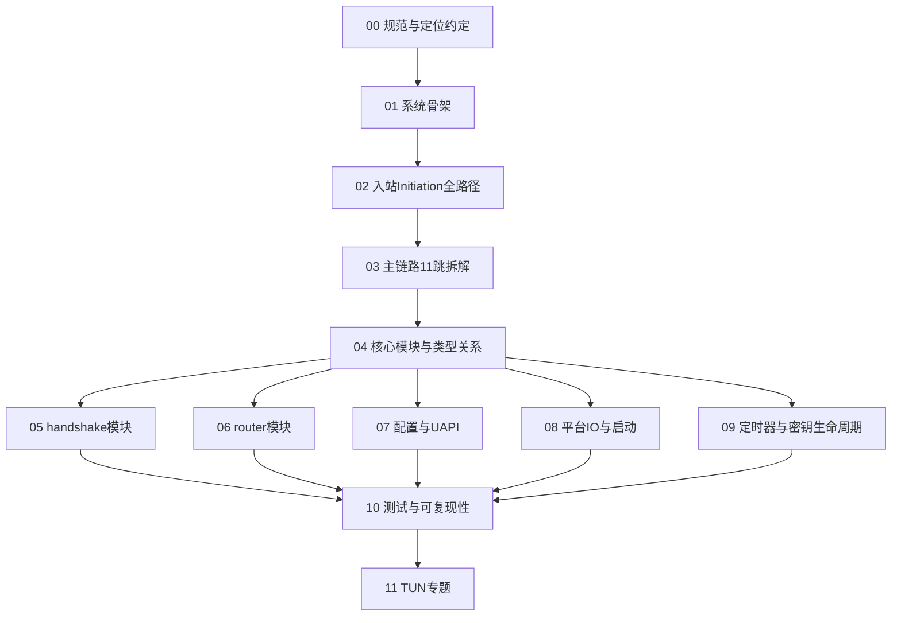

# wireguard-rs 四层源码文档库 · 总目录

> **项目**：wireguard-rs 0.1.4（Cargo.toml 声明，Rust edition 2018）
> **性质**：纯 Rust 用户态 WireGuard VPN 实现
> **文档目标**：新手可读、源码可定位、开发者可复现、能指导 Re-implement
> **定位规则**：见 [`00-文档规范与源码定位约定.md`](00-docs-style-guide.md)（禁止绝对行号；用 `文件路径 + 函数名 + 函数内相对偏移`；非函数用 `Struct:`/`Trait:`/`Const:`/`Module:` 稳定符号；调用双方同标）

## 四层结构总览

| 层 | 文件 | 一句话 |
|---|---|---|
| 规范 | [`00`](00-docs-style-guide.md) | 定位符、红线、术语、依赖标注约定 |
| 第一层 简单框架 | [`01`](01-简单框架-系统骨架.md) | 系统骨架、模块职责、依赖、主数据流、运行流程 |
| 第二层 简单例子 | [`02`](02-简单例子-全路径走读.md) | 入站 Handshake Initiation（响应侧）全路径走读 |
| 第三层 详细逐步 | [`03`](03-详细逐步说明-主链路拆解.md) | 主链路 11 跳逐跳拆解（谁调谁/参数/状态/错误） |
| 第四层 源码补齐 | [`04`](04-核心模块与类型关系图.md) | 模块依赖 + 核心类型关系 + trait→impl + 05~10 地图 |
| 第四层 | [`05`](05-handshake模块函数级解析.md) | handshake 模块函数级（device/noise/peer/messages/macs/ratelimiter/timestamp） |
| 第四层 | [`06`](06-router模块函数级解析.md) | router 模块函数级（device/peer/send/receive/route/worker/queue/anti_replay/ip） |
| 第四层 | [`07`](07-配置与UAPI函数级解析.md) | 配置与 UAPI 函数级（uapi set/get、config、error） |
| 第四层 | [`08`](08-平台IO与启动并发模型.md) | 平台 IO trait、main 启动并发、linux 实现、util、锁 |
| 第四层 | [`09`](09-定时器与密钥生命周期.md) | 定时器回调、KeyWheel 密钥三槽生命周期、常量语义 |
| 第四层 | [`10`](10-测试dummy平台与可复现性.md) | dummy 测试平台、三个测试套件、构建/测试复现命令 |
| 专题 | [`TUN`](../topics/TUN专题-虚拟网卡与项目实现.md) | TUN 虚拟网卡原理（通用知识）+ wireguard-rs 的 TUN 抽象/实现/数据路径集成 |

## 推荐阅读顺序

```text
00(规范) → 01(骨架) → 02(全路径) → 03(逐跳) → 04(类型关系)
   → 05(握手) → 06(路由) → 07(配置/UAPI) → 08(平台IO) → 09(定时器) → 10(测试/复现)
   → 11(TUN专题)
```

## 学习路径（Mermaid）



## 一条贯穿全库的主链路（纵向切片）

第二、三层选取的「真实最小可运行成功场景」：

```text
UDP 入站报文
  → udp_worker (workers.rs)
  → handshake_worker (workers.rs)
  → handshake::Device::process (handshake/device.rs)
  → noise::consume_initiation + create_response (handshake/noise.rs)
  → router::PeerHandle::add_keypair (router/peer.rs)
```

该切片一次性贯穿「握手」与「路由」两个 README 强调解耦的核心模块，且端到端可追踪，是理解整个项目的抓手。

## 源码基准与复现

- 全部结论基于当前仓库源码，未证实处显式标注「当前源码无法确定 / 未逐行读完」。
- 默认 `cargo test` 即可在普通用户、无 root、无真网卡下复现完整握手与加密传输（依赖内置 dummy 平台，见 `10`）。

[下一篇](01-简单框架-系统骨架.md)
