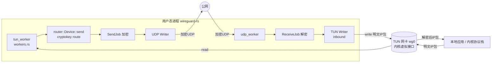

[总目录](../sourceReader/README.md) · [上一篇](../sourceReader/10-测试dummy平台与可复现性.md)

# 11 TUN 专题：虚拟网卡原理与 wireguard-rs 实现

> **版本**：wireguard-rs 0.1.4（Cargo.toml 声明，Rust edition 2018）
> **本篇性质**：专题（hybrid）——上半部分讲清楚 TUN 这一虚拟网络设备的通用技术知识（含网络查证），下半部分讲清楚本项目 `wireguard-rs` 如何把 TUN 抽象进代码并接入数据路径。
> **定位规则**：见 [`00-文档规范与源码定位约定.md`](../sourceReader/00-docs-style-guide.md)。项目代码部分使用「文件路径 + 函数名 + 函数内相对偏移」；通用知识部分给出权威出处（Linux 内核文档、WireGuard 白皮书等）。

---

## 1. 什么是 TUN（通用知识）

### 1.1 一句话定义

TUN（Network TUNnel）是 Linux 内核提供的一种**虚拟网络接口**，工作在**网络层（L3）**。它的一端是内核协议栈，另一端是一个**用户态程序**打开的文件描述符。

- 当内核协议栈要把一个 IP 包从这块「网卡」发出时，包不会走物理介质，而是**交给用户态程序**（通过 `read`）。
- 当用户态程序通过 `write` 把一段字节写进去时，内核协议栈会把它当作「从这块网卡收上来的 IP 包」来处理（路由、转发、交付给 socket）。

一句话：**TUN 让一个普通用户态进程变成了一块虚拟网卡的「另一端」**。这正是 WireGuard、OpenVPN、VTun 等隧道/VPN 软件的实现基石。

> 出处：Linux 内核文档《Universal TUN/TAP device driver》—— "TUN/TAP provides packet reception and transmission for user space programs. It can be seen as a simple Point-to-Point or Ethernet device, which, instead of receiving packets from physical media, receives them from user space program and instead of sending packets via physical media writes them to the user space program."

### 1.2 创建流程：open + TUNSETIFF ioctl

使用 TUN 设备的标准三步（内核文档给出的 `tun_alloc` 范例）：

```c
// 1) 打开字符设备（clone 设备）
fd = open("/dev/net/tun", O_RDWR);

// 2) 用 ifreq 指定名称与模式，发 TUNSETIFF ioctl 注册网络设备
struct ifreq ifr;
memset(&ifr, 0, sizeof(ifr));
ifr.ifr_flags = IFF_TUN;                 // 或 IFF_TAP | IFF_NO_PI ...
strscpy_pad(ifr.ifr_name, dev, IFNAMSIZ); // 形如 "wg0" / "tun%d"
ioctl(fd, TUNSETIFF, (void *)&ifr);       // 内核据此创建 tun0 / tap0

// 3) 之后对该 fd 的 read/write 就是收发 IP 包 / 以太帧
```

关键点：

- `/dev/net/tun` 字符设备主设备号 10、次设备号 200（`mknod /dev/net/tun c 10 200`）。创建网络设备需要 `CAP_NET_ADMIN` 能力（通常需要 root）。
- `ifr.ifr_name` 会被内核**回写**成真实设备名（如 `tun0`）。
- **进程关闭该 fd 时，对应的网络设备和所有相关路由自动消失**（这正是 `wireguard-rs` 用「关 fd 触发退出」实现优雅关停的依据，见 §4.3）。

### 1.3 关键标志位

`ifr.ifr_flags` 决定设备的类型与行为。本项目只用到其中两个，但完整认识有助于理解「为什么这么设计」：

| 标志 | 含义 |
|---|---|
| `IFF_TUN` | 创建 **TUN** 设备：用户态 `read/write` 的是**纯 IP 包**（无链路层头） |
| `IFF_TAP` | 创建 **TAP** 设备：用户态 `read/write` 的是**完整以太网帧**（含 MAC 头） |
| `IFF_NO_PI` | **不**在包前面附加 `struct tun_pi` 4 字节协议信息头（见 §1.4） |
| `IFF_MULTI_QUEUE` | 创建多队列设备，可多次 `TUNSETIFF` 同名设备拿多个 fd 做并行收发（内核 ≥ 3.8） |
| `IFF_ONE_QUEUE` | 单队列语义相关 |
| `IFF_VNET_HDR` | 支持 virtio-net 头（虚拟化场景） |
| `IFF_BACKPRESSURE` | 开启 qdisc 背压，避免 TX 丢包（见 §1.7） |

> 出处：内核文档 §3.1 Frame format / §3.3 Multiqueue。

### 1.4 帧格式（为什么本项目 read 要带 offset）

当**未设置** `IFF_NO_PI` 时，每个从 fd 读出的包前面会带 4 字节 `struct tun_pi`：

```text
Flags [2 字节] | Proto [2 字节] | Raw protocol frame (IP / IPv6 / ...)
```

而设置 `IFF_NO_PI` 后，用户态直接拿到**裸 IP 包**，没有这 4 字节前缀。

本项目 `LinuxTun::create` 的 `flags` 用了 `IFF_TUN | IFF_NO_PI`（见 §3.2），所以读到的就是干净 IP 包。但注意：**就算没有内核的 PI 头，本项目自己也在缓冲区前面预留了 `SIZE_MESSAGE_PREFIX`（16 字节）的空间**，用途是把解密/加密后的 transport message 在**原地**拼出来（见 §4.4）。这两个「前缀」是完全不同的概念，不要混淆。

### 1.5 TUN vs TAP

| 维度 | TUN | TAP |
|---|---|---|
| 工作层 | L3（网络层） | L2（数据链路层） |
| 收发内容 | IP 包（无 MAC） | 以太网帧（有 MAC、ARP） |
| 典型用途 | IP 隧道 / 路由型 VPN（WireGuard、OpenVPN tun 模式） | 桥接 / 二层 VPN / 虚拟机网桥 |
| 是否需要 ARP | 否 | 是 |
| 像什么 | 一个点对点 IP 接口 | 一块虚拟交换机端口 |

WireGuard 选用 TUN（L3）而非 TAP（L2），原因在于：WireGuard 是**路由型**隧道，按目标 IP 子网「cryptokey route」到对端，不需要也不希望处理 ARP、MAC 学习等二层细节，L3 更轻、更简单、攻击面更小。

### 1.6 多队列（multiqueue）

从内核 3.8 起，TUN/TAP 支持多队列：对同一设备名多次 `open("/dev/net/tun")` + `TUNSETIFF`（`IFF_MULTI_QUEUE`），**每次得到一个独立的 fd（队列）**。多个队列可以绑定到不同 CPU，实现收发的并行化。`TUNSETQUEUE` ioctl（配 `IFF_ATTACH_QUEUE` / `IFF_DETACH_QUEUE`）可在线增删队列。

本项目当前 Linux 实现**只开单队列**（`src/platform/linux/tun.rs` 函数：`create`，返回 `vec![LinuxTunReader { fd }]`，并标注 `// TODO: use multi-queue for Linux`），这是一处明确的待优化点。

### 1.7 qdisc 背压（IFF_BACKPRESSURE）

默认情况下，当 TUN 内部环形缓冲区满时直接**丢包**（TX drop），附着的 qdisc 被绕过。设 `IFF_BACKPRESSURE` 后，内核改为**停队列**，让 qdisc 的 AQM / 整形 / 公平调度真正生效——这对依赖「丢包即降速」语义的 TCP 更友好，可缓解 bufferbloat。该标志是**设备级**属性，对所有队列生效，且只能在设备最多一个队列时修改（多队列下 `TUNSETIFF` 成功但标志不变）。本项目未使用此标志。

### 1.8 跨平台 TUN 实现

TUN 概念通用，但各 OS 的「克隆设备」与 ioctl 不同。常见实现：

| 平台 | 设备 / API | 备注 |
|---|---|---|
| Linux | `/dev/net/tun` + `TUNSETIFF` | 本项目 `linux` 平台走这条 |
| macOS / iOS | `utun`（`PF_SYSTEM`/`SYSPROTO_CONTROL`，`utun_control`）+ `ioctl SIOCAIFADDR`） | WireGuard-Go、boringtun 在 macOS 走 `utun` |
| Windows | **Wintun**（三层，Ring 0/3 环形缓冲，官方推荐替代旧 TAP-Windows） | WireGuard 官方 Windows 客户端用 Wintun |
| 其他 BSD | 各自 `tun` 字符设备 | — |
| Rust 生态 | `meh/rust-tun` 等 crate 封装上述差异，目标跨平台 | 本项目**未**用此 crate，而是自己写 `platform` 抽象（见 §3） |

---

## 2. TUN 在 WireGuard / VPN 中的角色

### 2.1 为什么 VPN 用 TUN

用户态 VPN 的套路（以 WireGuard 为例）：

1. 创建一块 TUN 网卡（如 `wg0`），配置 IP 与路由（把目标子网指到 `wg0`）。
2. 应用层 `read` 从 TUN 拿到**明文 IP 包**。
3. 加密 + 封装成 UDP 包，发给对端公网地址。
4. 对端从 UDP 收到后解密，把明文 `write` 回它自己的 TUN 网卡。
5. 内核协议栈把解密后的包按路由继续投递。

于是「TUN 网卡 ↔ 用户态加密 ↔ UDP 隧道 ↔ 对端 TUN 网卡」构成一条加密隧道。WireGuard 把「目标 IP 子网 → 哪个 peer」的映射称为 **cryptokey route**（`router::RoutingTable`，见文档 `06`）。

### 2.2 WireGuard 默认 MTU 1420 的由来

WireGuard 隧道的 MTU 通常设为 **1420**，而不是底层网卡的 1500。开销拆解：

```text
1500 (底层以太网 MTU)
  - 40  IPv6 外层 IP 头（按最坏情况 IPv6 算，而非 IPv4 的 20）
  - 8   UDP 头
  - 16  WireGuard transport header：4(type) + 4(receiver) + 8(counter)
  - 16  AEAD 认证标签 (Poly1305)
  ─────────────────────
  = 1420
```

即 `1500 - 80 = 1420`。之所以按 IPv6 外层（40 字节）而非 IPv4（20 字节）预留，是为了保证即使在 IPv6 承载网下，内层包也不会因超出 MTU 被分片。`wireguard-rs` 的 dummy 测试平台直接返回 `TunEvent::Up(1420)`（`src/platform/dummy/tun/dummy.rs` 函数：`event` 偏移：`+3`），与这个业界默认一致；而 `start_up` feature 下返回 `Up(1500)`（跳过真实 MTU 探测）。

### 2.3 wireguard-rs 是用户态实现

项目 README 明确警告：**"YOU SHOULD NOT RUN THIS ON LINUX. Instead use the kernel module."** 因为 Linux 上官方 `wireguard` 内核模块更快、更省 CPU。本项目的价值在于：它是一个**纯 Rust 用户态**实现，便于学习/移植/审计，可在缺少内核模块的平台（或测试环境）运行。也正因是用户态，它必须自己开 TUN、自己读 `read/write`、自己跑加密——这正是本专题下半部分要讲的内容。

### 2.4 流量如何被「引」进 TUN：内核路由 + 策略路由（两层模型）

一句话：让指定流量走 TUN，本质是**在主机的路由系统里写好规则，让相应包从 `wg0` 这个虚拟网口出去**；而 WireGuard 内部还有第二层「cryptokey route」决定包加密后发给哪个 peer。下面把这两层拆开，并给出 `wg-quick` 在背后实际执行的命令（出处：WireGuard 官方 `wg-quick(8)` man 页、pro-custodibus 社区实测与内核路由文档）。

#### 2.4.1 内核为什么能把包交给一块「虚拟网卡」

TUN 一旦被创建并 `ip link set up` + 配上 IP，对内核协议栈而言它就是一块**普通网络接口**，和 `eth0` 没有本质区别。本地进程发送数据时，内核走标准的**出向路由查找（FIB lookup）**：根据目标 IP 在路由表中选一条最匹配的路由，路由里指定了出口设备和（必要时）下一跳；选定出口后，把包交给该设备的驱动。

- 出口是 `eth0` → 包走物理网卡发出。
- 出口是 `wg0`（TUN）→ 包被交给 TUN 驱动，驱动把它放进那个 fd 的读队列，**唤醒**在 `read(fd)` 上阻塞的用户态进程。

这就是项目里 `tun_worker`（`src/wireguard/workers.rs` 函数：`tun_worker`）拿包的源头：包不是由 wireguard-rs「主动去抓」的，而是**内核按路由表决定从 `wg0` 出、从而送进 TUN fd** 的。可用 `ip route get <目标IP>` 直接观察内核为某个目标选了哪个出口。

#### 2.4.2 「指定流量」= 路由条目，由 AllowedIPs 推导

所谓「把指定流量转到 TUN」，就是把一条条**路由**指向 `wg0`。在 WireGuard 生态里，这些路由几乎不用手敲——`wg-quick`（官方提供的极简启动脚本，本质是包装 `wg(8)` 与 `ip(8)` 的 bash 脚本）会根据每个 peer 的 `AllowedIPs` **自动推断并添加路由**（man 页原文：*"It infers all routes from the list of peers' allowed IPs, and automatically adds them to the system routing table."*）。

`wg-quick up wg0` 在背后大致做这些事（man 页《DESCRIPTION》）：

1. `ip link add wg0 type wireguard`（内核模块场景；用户态实现见 2.4.5）并 `wg setconf` 写入密钥/peer。
2. 给接口配 `Address`（多个 IP 可叠加），`ip link set mtu <n> up`。
3. **由 AllowedIPs 推断路由**并加入系统路由表。
4. 按需执行 `PreUp`/`PostUp` 脚本（DNS、防火墙、自定义策略路由等）。

于是：

- `AllowedIPs = 10.0.0.0/24` → 仅访问该子网时，路由命中 `dev wg0` → 进隧道（**分流 / split tunnel**）。
- `AllowedIPs = 0.0.0.0/0`（含 `::/0`）→ 默认路由被「接管」为走 `wg0` → 全局 VPN。

#### 2.4.3 默认路由（0.0.0.0/0）的特殊处理：策略路由 + fwmark 防回环

如果直接 `ip route add 0.0.0.0/0 dev wg0` 写进主表，会出大问题：WireGuard 加密后的 UDP 包本身也要从物理网卡出去，但它同样匹配「默认路由走 wg0」，于是被重新塞回隧道——**死循环（routing loop）**。

`wg-quick` 的解决办法是**不污染主表**，而是开一张独立路由表 + 用防火墙标记（fwmark）区分「已加密的隧道流量」和「待加密的普通流量」。对 `AllowedIPs` 含 `0.0.0.0/0` 的情况，它实际执行（以 fwmark/表号 51820 = 0xca6c 为例，来自 wg-quick 与多篇实测）：

```bash
wg set wg0 fwmark 51820                        # 给 WireGuard 自己发出的加密 UDP 打标记
ip -4 route add 0.0.0.0/0 dev wg0 table 51820  # 在独立表 51820 里，默认路由走 wg0
ip -4 rule  add not fwmark 51820 table 51820   # 没打标记的包 → 查表 51820（即走隧道）
ip -4 rule  add table main suppress_prefixlength 0  # 查主表时，抑制默认路由(前缀长0)
sysctl -q net.ipv4.conf.all.src_valid_mark=1    # 让 fwmark 在出向被保留/校验
```

此时 `ip rule show` 大致是：

```text
0:      from all lookup local
32764:  from all lookup main suppress_prefixlength 0
32765:  not from all fwmark 0xca6c lookup 51820
32766:  from all lookup main
32767:  from all lookup default
```

**跟一个具体包走一遍**（目标 8.8.8.8，普通上网包，无标记）：

1. 规则 0 → 查 `local` 表，不命中。
2. 规则 32764 → 查 `main` 但 `suppress_prefixlength 0`：主表里只有「默认路由」前缀长为 0，被抑制；具体直连路由仍可用。本例 8.8.8.8 在主表无具体路由，继续。
3. 规则 32765 → `not fwmark 0xca6c` 为真（包没标记）→ 查表 51820 → 命中 `default dev wg0` → **包进 wg0**。
4. 进 wg0 后被加密，且因 `wg set wg0 fwmark 51820`，新生成的 UDP 包被打上 0xca6c 标记。
5. 加密 UDP 包再次进入路由：规则 32765 因「有标记」**不匹配** → 落到规则 32766 查 `main` → 命中主表默认路由（物理网卡）→ **从真实网卡发出，不回灌隧道**。回环消除。

> 此外，默认路由模式下 wg-quick 还会加一组 nftables/iptables 规则（prerouting 的 raw 链 `iifname != "wg0" ip daddr <接口IP> fib saddr type != local drop` 防外部假冒接口 IP 进来的包；以及 mangle 链用 CONNMARK 把隧道 UDP 流的 mark 存/取，确保回包也走正确路径）。这些是为了加固，不是路由本身。

#### 2.4.4 更细的引流：策略路由与按端口/源地址分流

`AllowedIPs` 是「按目标子网」粗粒度引流。要更精细（按源地址、按端口、按协议），用 `Table` + `PreUp` 配合 `ip rule` 即可。man 页给的例子：让 **SSH（TCP 22）** 才走隧道，其余走原默认路由：

```ini
[Interface]
Address = 10.192.122.1/24
Table = 1234                                   # 路由写进自定义表 1234（而非主表/默认表）
PostUp   = ip rule add ipproto tcp dport 22 table 1234
PreDown  = ip rule delete ipproto tcp dport 22 table 1234
[Peer]
AllowedIPs = 0.0.0.0/0
```

这里 `Table = 1234` 让 AllowedIPs 推导出的路由落在表 1234，再只用一条 `ip rule` 把「TCP 目的端口 22」的流量引到该表——实现「仅 SSH 走隧道」。`Table = off` 则可完全**关闭**自动加路由（完全手动控制），`auto` 是默认。

反过来，**国内外分流**通常让客户端 AllowedIPs 写具体海外网段，或技巧性地用 `0.0.0.0/1, 128.0.0.0/1` 两个 /1 覆盖全网但优先级高于默认，再手动加国内直连——从而国内流量仍走物理网卡、国外走 wg0。本质仍是「路由表决定出口」。

#### 2.4.5 内核模块 vs 用户态（wireguard-rs）：引流机制相同，建接口方式不同

要强调：**上面整套管路由/策略路由知识，对内核版和用户态版 WireGuard 完全通用**——引流是主机网络栈的事，与「加解密在内核还是用户态」无关。

差异只在「`wg0` 接口和 UAPI 从哪来」：

- 内核版：`ip link add wg0 type wireguard`（需要内核 wireguard 模块），`wg` 工具经 netlink 配它，`wg-quick` 一条龙。
- 用户态（本项目）：`wireguard-rs wg0` 自己用 `PlatformTun::create`（`src/platform/linux/tun.rs` 函数：`create`）调 `TUNSETIFF` 建好 TUN，再暴露一个 **UAPI** Unix 套接字（`src/platform/linux/uapi.rs`）供 `wg(8)` 配置。README 明确：*"instead simply run: wireguard-rs wg0"*，然后 *"use wg(8) to configure it"*。

也就是说，**wireguard-rs 自身不写任何系统路由**（通读 `src/main.rs` 与 `src/platform/`，只有 `Tun::create`、起 reader 线程、`status.event()` 监听 up/down，没有任何 `ip route`）。决定「什么流量进 TUN」的是 wg-quick / 你手动的 `ip route` / 自定义脚本；wireguard-rs 只负责消费已经被路由到 `wg0` 的包。

#### 2.4.6 第二层：进 TUN 之后，WireGuard 怎么选对端（cryptokey route）

包一旦被 `read` 出来（明文 IP 包），就进入 WireGuard 内部的**第二张路由表**——项目里的 `router::RoutingTable`（cryptokey route）。它把「目标 IP → 哪个 peer」映射起来，与第一层的 OS 路由是两回事：

```text
tun_worker.read(明文IP包)                      ← 第一层之后：包已到用户态
  → router::Device::send                       (src/wireguard/router/device.rs 函数：send)
  → table.get_route(packet)                    ← 第二层：按目标 IP 选 peer
  → peer.send → 加密(ChaCha20Poly1305) → UDP 写出
```

入站反向：对端 UDP 到达 → `router::Device::recv` → 解密 → `ReceiveJob::sequential_work`（`src/wireguard/router/receive.rs` 函数：`sequential_work` 偏移：`+41`）里 `peer.device.inbound.write(&packet)` 把明文**写回 TUN** → 内核再按第一层路由把包投递给本地 socket。

#### 2.4.7 小结

- **第一层（主机路由）**决定「什么流量出 `wg0`」：`wg-quick` 依 `AllowedIPs` 加路由；默认路由用「独立表 + fwmark + suppress_prefixlength 0」防回环；可借 `Table`/`ip rule` 做按端口或按网段的分流。
- **第二层（cryptokey route）**决定「进隧道后发给哪个 peer」：`router::RoutingTable` 按目标 IP 选 peer 并加密。
- **wireguard-rs 只消费第一层的结果**，自己不配路由、不建策略路由；它的职责是从 TUN fd 读、加密、写 UDP，以及把解密包写回 TUN。

#### 2.4.8 进程被杀后的残留与清理（kill 不等于干净卸载）

接 2.4.3（默认路由防回环）与 2.4.5（用户态差异），这里把「怎么撤」讲全。

**核心结论先给：**

- `ip route`（指向 `wg0` 的路由）：进程被杀后**被内核自动清除**，不再生效。
- `ip rule`（策略路由规则）：**不会**自动清除，会以「孤儿规则」残留在策略库。
- 防火墙规则（nftables/iptables）、DNS：都**不会**自动还原。
- 没有「自动还原拨号前状态」的功能；只有 `wg-quick down` 才显式撤回全部。

**为什么 `ip route` 会自动没：** 这是内核 TUN/TAP 驱动的硬行为（非 WireGuard 自行为之）。官方文档原文：*"When the program closes the file descriptor, the network device and all corresponding routes will disappear."* —— 只要持有 `/dev/net/tun` fd 的进程一死（fd 关闭），内核就销毁 `wg0` 设备，并冲刷掉所有指向它的路由（含主表与自定义表如 51820 里的 `dev wg0` 条目）。所以「流量被引到 TUN」这件事，进程一挂就自然失效。

**为什么 `ip rule` / 防火墙残留：**

- `ip rule` 是策略规则，**不直接绑定设备**，只声明「查某张表」。内核销毁接口时不会去扫描策略库删规则。例如这两条会留下：
  ```text
  32764:  from all lookup main suppress_prefixlength 0
  32765:  not from all fwmark 0xca6c lookup 51820
  ```
  它们变成悬空规则：所查的表 51820 此刻已空，实际无害（流量最终落回主表默认路由、恢复上网），只是留着碍眼。
- 防火墙规则（wg-quick 加的 nftables/iptables，如 `iifname != "wg0" ... drop`）按接口名匹配，`wg0` 没了就成了空转规则，但**条目仍留在规则集**。
- DNS（`resolvconf` 写入）也不会自动恢复。

**内核模块版 vs 用户态（wireguard-rs）的差异：**

| | 杀掉相关进程后 |
|---|---|
| 内核模块 WireGuard | 没有常驻进程——`wg` 只是控制工具，`wg0` 活在 kernel 里。杀进程（脚本早退出）**什么都不会自动清理**，接口/路由/规则/防火墙全留着，必须 `wg-quick down` 或 `ip link del wg0`。 |
| 用户态 wireguard-rs（本项目） | 守护进程**持有 TUN 的 fd**，进程一死 → fd 关闭 → 内核销毁 `wg0` → **路由自动冲刷**。但 wg-quick 加的 `ip rule`/防火墙/DNS 照样残留，因为 `src/main.rs` 与 `src/platform/` **从不碰系统路由**（见 2.4.5），撤规则是 wg-quick 的职责，与守护进程生死无关。 |

换句话说：**无论优雅退出还是 `kill -9`，对「路由」的结果一样（内核冲刷）；差别只在 wg-quick 的 `down` 脚本有没有跑过**——而 wireguard-rs 自己既不建也不撤这些规则。

**正确清理方式：**

- **首选**：`wg-quick down wg0`。它读回 `/etc/wireguard/wg0.conf`，逆序撤销每一步：`ip rule del`、清防火墙、删接口（冲刷路由）、恢复 DNS。它**幂等**，进程死了多少次都能单独补跑，不依赖守护进程还在。
- **手动**：`ip link del wg0`（冲刷路由）+ `ip rule del not fwmark 51820 table 51820` + `ip rule del table main suppress_prefixlength 0` + flush 对应防火墙链。
- 本项目的专用路径（README）：`rm -f /var/run/wireguard/wg0.sock` 会令守护进程退出 → TUN fd 关闭 → 设备销毁 → 路由冲刷；但**同样不会**清掉 wg-quick 留下的规则与防火墙。

> 一句话：**杀进程 ≠ 干净卸载。** 路由被内核自动清掉（fd 关闭即设备亡），但 `ip rule`、防火墙、DNS 不会自动还原；想彻底干净，得 `wg-quick down wg0`（哪怕进程早死了也能补跑）。

#### 2.4.9 多 TUN 重叠优先级、跨平台客户端（macOS/iOS/Android）与无 root 处理

前面 2.4.1~2.4.8 都站在 Linux 单接口、单进程的视角。现实里常遇到：挂了多个 TUN（多个 WireGuard 接口、或 VPN 叠加），路由互相重叠；以及客户端平台与权限差异。本节补齐这三个死角（出处：wg-quick(8) man 页、Android Developers VpnService 文档、optman 的 Android VpnService 源码分析、scivision.dev 的 macOS 网络顺序说明、Apple 官方「change order network services」）。

##### 2.4.9.1 Linux：多个 TUN 设置重叠时，流量优先级怎么定

判定是**三层、按顺序**的（与 2.4.3 的「第一层路由」同一套机制）：

1. **先查策略路由规则 `ip rule`** —— 决定「用哪张路由表」，选择器可以是 fwmark、源地址、入接口、UID 等。这是最优先的一关。
2. **再在选中的表内做最长前缀匹配** —— `10.0.0.0/24` 永远优先于 `0.0.0.0/0`。
3. **前缀相同则比 metric** —— 数值小的优先。

落到「两个 TUN 都声明 `0.0.0.0/0`」这种重叠：

- 若都往**主表**塞默认路由 → 比 **metric**，谁小谁吃默认流量；同 metric 不可靠（内核按 nexthop 顺序兜底）。
- 更常见是**各用各的独立表 + 各自 fwmark**（即 2.4.3 对默认路由的处理）。例如 wg0→表 51820/fwmark 51820，wg1→表 51821/fwmark 51821，规则级联成：
  ```text
  not fwmark 51820 table 51820   # 未标记 → 查 wg0 表
  not fwmark 51821 table 51821   # 仍未被标记 → 查 wg1 表
  lookup main (带 suppress_prefixlength 0)
  ```
  **未打标记的普通流量命中「第一条」匹配规则** —— 也就是**先起来的那个接口（规则优先级号更小、排更上面）优先**当默认出口。
- **最佳实践**：能不重叠就别重叠——用更具体的 CIDR 做**分流（split tunnel）**从根上避免两个 `0.0.0.0/0` 互踩；必须叠加时用 `Table=`/`PostUp` + `ip rule` 显式按端口/源地址/应用分流（见 2.4.4）。

##### 2.4.9.2 客户端平台（macOS/iOS/Android）怎么处理

三个平台的共同点：**都用平台官方 VPN API，应用自己拿 TUN 的 fd，但绝不直接碰内核路由/规则——由系统的特权组件代劳。** 「多 TUN / 路由优先级」本质仍是 2.4 讲的「策略路由 + 多表」，只是入口 API 不同。

**macOS / iOS（同属 Darwin，用 `utun` + NetworkExtension）：**

- `utun` 是 Darwin 上的 TUN 设备（不是 `/dev/net/tun`，而是 `PF_SYSTEM/SYSPROTO_CONTROL`）。VPN App 通过 **NetworkExtension 的 Packet Tunnel Provider** 创建 `utun`，拿到 fd 后只负责加解密。
- **路由优先级由「服务顺序（Set Service Order）/ 接口 rank」决定**：Apple 路由表里每个网络服务有偏好值，按 `System Preferences → 网络 → 设定服务顺序`（`networksetup -ordernetworkservices`）排定；也可对单条路由设 metric。判定仍是**最长前缀优先，默认路由看服务顺序高低**（出处：scivision.dev 的 macOS 网络优先级说明、Apple 官方「change order network services」）。
- 默认**同时一个主 VPN**；iOS 支持 **per-app VPN**（托管/MDM），可做到按 App 分流。
- **不需要 root**：NetworkExtension 是系统特权扩展，App 本身非特权。

**Android（Linux 内核 + `VpnService`）：**

- 底层和命令行**完全等价**——有人扒源码确认（optman 的 Android VpnService 代码分析），最终还是靠 **fwmark（socket mark）+ `ip rule` + 多张路由表**，由特权守护进程 **`netd`** 执行。
  - `Fwmark` 32 位里含 `netId`（对应一张路由表）、`protectedFromVpn` 等位；`FwmarkServer` 用 `SO_MARK` 给 socket 打标。
  - `Builder.addRoute()` 的路由被 `RouteController` 放进该 VPN 专属表，再由 netd 管理的 `ip rule` 把打了标的包引到这张表。
- **分流能力很强**：`addAllowedApplication`/`addDisallowedApplication`（按 UID 进/出隧道）、`allowBypass()`/`protect()`（按 socket 旁路）、`excludeRoute()`（split tunnel 排除网段）。
- 默认**同时只能一个主 VPN**；多 VPN 靠 App 用 `ConnectivityManager` 指定要用哪张网，或 per-app 规则。
- **不需要 root**：App 走 `VpnService` + 用户授权（`prepare()`），重活（Netlink、`ip rule`、`ip route`）由带 `NETWORK_STACK` 权限的 netd 干。

> 小结：macOS/iOS 的「服务顺序」、Android 的「fwmark + netd」，都是 2.4 的「策略路由 + 多表」在平台层的封装，只是封装入口不同。

##### 2.4.9.3 没有 root 权限怎么办

- **Linux 服务端 / 无特权进程**：创建 TUN 必须经 `/dev/net/tun` + `TUNSETIFF`，需要 **`CAP_NET_ADMIN`**（root 或 `setcap cap_net_admin+ep`），加系统路由也要它。没有会怎样？`TUNSETIFF` 返回 `EPERM` → wireguard-rs 直接报 `LinuxTunError::SetIFFIoctlFailed (insufficient permissions?)`（见 3.2）。**没有 root/CAP_NET_ADMIN，就建不了真正的 TUN 隧道**。替代思路：
  - 让特权助手先建好 TUN，再交给非特权进程用（常见做法）；
  - 改用**不走内核路由**的代理（SOCKS / HTTP 代理；TPROXY 仍需 CAP_NET_ADMIN，故不行）——但那已不是 TUN 隧道；
  - 桌面环境走 **NetworkManager + WireGuard 插件**（仍要一次授权）。
- **macOS / iOS / Android 客户端**：本来就不该有 root——它们的 VPN API 让**非特权 App 拿到 TUN fd，系统组件负责建接口 + 写路由**，所以无 root 完全 OK，也是能上架商店的前提。
- **项目本身**：wireguard-rs 目前只针对 Linux（README 写 Linux 能跑、Win/BSD「coming soon」）。在 macOS/iOS 上它并不能直接跑（没有 `/dev/net/tun`，且需 NetworkExtension）——那类平台走的是 wireguard-go（`utun` / `Wintun` + NE 封装）那一套。所以「无 root」的疑虑在三个客户端上根本不存在。

##### 2.4.9.4 小结

- **优先级判定**（Linux）：`ip rule` 选表 → 表内最长前缀 → 同前缀比 metric；多默认路由靠 fwmark + 独立表级联，先 up 的接口优先。
- **客户端**：都用平台 VPN API（macOS/iOS 的 NetworkExtension/`utun`、Android 的 `VpnService`），应用只拿 fd、不碰路由；macOS/iOS 靠服务顺序定默认路由，Android 靠 netd 的 fwmark + 多表。
- **无 root**：Linux 必须 `CAP_NET_ADMIN`（root/`setcap`），否则 `TUNSETIFF` 失败；三个客户端因系统代劳而天然无需 root。

---

## 3. wireguard-rs 中的 TUN 实现（项目代码）

### 3.1 抽象层：一组 trait（src/platform/tun.rs）

项目把 TUN 抽象成四个 trait，使核心路由逻辑与具体 IO 完全解耦：

```text
Trait：Tun        (文件：src/platform/tun.rs)  —— 汇总类型关联：Writer / Reader / Error
Trait：Reader     (文件：src/platform/tun.rs)  —— fn read(&self, buf, offset) -> Result<usize>
Trait：Writer     (文件：src/platform/tun.rs)  —— fn write(&self, src) -> Result<()>
Trait：Status     (文件：src/platform/tun.rs)  —— fn event(&mut self) -> Result<TunEvent>
Trait：PlatformTun(文件：src/platform/tun.rs)  —— fn create(name) -> (Readers, Writer, Status)
```

- `TunEvent`（枚举）：`Up(usize)` 接口起来（携带 MTU）、`Down` 接口 down。
- `Tun::Reader` 的 `read(buf, offset)` 设计要点：入参要求 `buf` 在 `offset` 之前预留空间，理由是「某些平台包前面带 header，预留空间后续可原地构造 transport message」。本项目 Linux 用 `IFF_NO_PI` 没有内核 PI 头，但**仍利用这个 offset 预留 `SIZE_MESSAGE_PREFIX`** 给自己拼 transport 头（见 §4.4）。
- `PlatformTun::create` 返回 `Vec<Self::Reader>`（支持多队列）、单个 `Writer`、一个 `Status`——接口天然为多队列预留。

### 3.2 Linux 实现（src/platform/linux/tun.rs）

| 结构 / 函数 | 文件内位置 | 作用 |
|---|---|---|
| `LinuxTunReader` / `LinuxTunWriter` / `LinuxTunStatus` | `linux/tun.rs` | 围绕一个 `RawFd` 的三个句柄 |
| `LinuxTun::create` | 函数：`create` 偏移：`+0~+33` | `open("/dev/net/tun")` → 填 `Ifreq{flags: IFF_TUN\|IFF_NO_PI}` → `ioctl(TUNSETIFF)`；返回 `vec![reader]`, `writer`, `status` |
| `impl Reader for LinuxTunReader::read` | 函数：`read` 偏移：`+0~+14` | `libc::read(fd, buf[offset..], len-offset)`，负返回视为 `Closed` |
| `impl Writer for LinuxTunWriter::write` | 函数：`write` 偏移：`+0~+7` | `libc::write(fd, src)`，`-1` 视为 `Closed` |
| `impl Status for LinuxTunStatus::event` | 函数：`event` 偏移：`+0~+86` | 用 **netlink**（`NETLINK_ROUTE`）监听 `RTM_NEWLINK`，按 `IFF_UP` 产生 `Up(mtu)` / `Down` |
| `LinuxTunStatus::new` | 函数：`new` 偏移：`+0~+38` | 建 netlink socket，订阅 `RTNLGRP_LINK/IPV4_IFADDR/IPV6_IFADDR`，`start_up` feature 下预置 `Up(1500)` |
| `get_mtu` | 函数：`get_mtu` 偏移：`+0~+38` | `socket(AF_INET,SOCK_DGRAM)` + `ioctl(SIOCGIFMTU)` 取 MTU |

要点：

- 错误类型 `LinuxTunError` 覆盖了「名字过长 / 打不开克隆设备 / TUNSETIFF 失败（多半权限不足）/ 取 MTU 失败 / netlink 失败 / 已关闭」六类。
- `TUNSETIFF` 魔数 `0x4004_54ca` 与 `Ifreq`/`IfInfomsg` 布局直接对齐内核 `uapi` 头（代码注释给出 bootlin 源码链接）。
- **状态感知用 netlink 而非轮询**：监听网卡 up/down 与地址变化，是生产级实现的正确做法（要感知 `wg0` 被 `ip link set wg0 up/down`）。

### 3.3 dummy（测试）实现（src/platform/dummy/tun/）

这是项目「无 root、无真网卡即可跑完整握手与加密传输」的关键（详见文档 `10`）。

| 结构 / 函数 | 文件内位置 | 作用 |
|---|---|---|
| `TunTest` | `dummy/tun/dummy.rs` | 实现 `Tun` / `PlatformTun` 的占位类型 |
| `TunFakeIO` | `dummy/tun/dummy.rs` | 模拟「内核/OS 那一端」，提供 `write`/`read` 供测试脚本注入/抽取 IP 包 |
| `TunReader` / `TunWriter` | `dummy/tun/dummy.rs` | 基于 `sync_channel`（`mpsc`）的收发对 |
| `TunTest::create` | 函数：`create` 偏移：`+0~+28` | 建两对 `sync_channel`（store 时容量 32，否则 1），返回 `(TunFakeIO, reader, writer, status)` |
| `impl Reader::read` | 函数：`read` 偏移：`+0~+14` | `rx.recv()` 取出对端喂入的字节，拷到 `buf[offset..]` |
| `impl Writer::write` | 函数：`write` 偏移：`+0~+19` | `tx.send()` 把 outgoing 包发给 `TunFakeIO`（`store=false` 时直接丢弃，用于基准） |
| `impl Status::event` | 函数：`event` 偏移：`+0~+11` | 首次返回 `Up(1420)`，之后 `sleep(1h)` 阻塞（测试不需要真实 up/down） |

`PlatformTun for TunTest::create` 故意返回 `Err(Disconnected)`——因为它不走 `PlatformTun::create`，而是走 `TunTest::create(store)`，由测试直接在用户态把 `TunFakeIO` 接到加密链路两端。

### 3.4 void 实现（基准用，当前被注释）

`src/platform/dummy/tun/void.rs` 整段被 `/* ... */` 注释掉了。其意图是「读永远空、写立刻丢弃不报错」，用于**只测入站路径**（inbound）的基准/性能剖析（注释写明 "used during benchmarking and profiling of the inbound path"）。代码里有个明显 bug（`impl Reader for VodReader` 拼错、`write` 写在 Reader 上），因此被整体注释，未启用。

### 3.5 平台分发（src/platform/mod.rs 等）

```text
Module：platform (文件：src/platform/mod.rs)
  ├─ cfg(target_os="linux")  → pub mod linux  → pub use linux as plt
  ├─ cfg(test)               → pub mod dummy
  └─ 无条件：endpoint / tun / uapi / udp 四个 trait 模块

linux/mod.rs  : pub use tun::LinuxTun as Tun   —— 生产用 Linux TUN
dummy/mod.rs  : pub use tun::*                  —— 测试用 TunTest
```

`main.rs` 通过 `plt::Tun::create(...)` 拿设备（`plt` 在 Linux 下即 `linux` 模块），核心代码全程只依赖 `tun::Tun` / `tun::Reader` / `tun::Writer` / `tun::Status` 这几个 trait，不感知具体平台——这就是抽象的价值。

---

## 4. TUN 在 wireguard-rs 数据路径中的集成

### 4.1 出站：明文 IP 包 → 加密 → UDP 发出

`src/wireguard/workers.rs` 函数：`tun_worker` 偏移：`+0~+43`：

```text
tun_worker 循环：
  mtu = wg.mtu
  msg = vec![0; mtu + SIZE_MESSAGE_PREFIX(16) + 1 + CAPACITY_MESSAGE_POSTFIX(16)]
  n = reader.read(&mut msg[..], SIZE_MESSAGE_PREFIX)   // TUN 读入明文 IP 包，落在 offset 16 之后
  if mtu == 0 { continue }                             // 设备 down 则丢弃
  padded = padding(n, mtu)                             // 按 MESSAGE_PADDING_MULTIPLE(16) 对齐
  msg.truncate(SIZE_MESSAGE_PREFIX + padded)
  wg.router.send(msg)                                  // → cryptokey route + 加密 + UDP 发出
```

`router::Device::send`（`src/wireguard/router/device.rs` 函数：`send` 偏移：`+0~+19`）按目标 IP 查 `RoutingTable` 找到 peer，交给 `Peer::send` 入队 → `SendJob::parallel_work` 加密、`sequential_work` 经 `send_raw` 写 UDP。

### 4.2 入站：UDP 收包 → 解密 → 写回 TUN

`src/wireguard/router/receive.rs` 函数：`ReceiveJob::sequential_work` 偏移：`+0~+50`：

```text
解密 + cryptokey route 校验（parallel_work）
→ 顺序段：anti-replay 更新、确认密钥、更新 endpoint
→ if let Some(inner) = inner_length(packet) {        // 取内层 IP 包长度（ip.rs）
     if inner + SIZE_TAG <= packet.len() {
       peer.device.inbound.write(&packet[..inner])    // ★ 写回 TUN 网卡（用户态 write）
     }
   }
→ 触发 C::recv 回调（更新计时器/统计）
```

这里的 `peer.device.inbound` 就是 `DeviceInner::inbound: T`（`router/device.rs` Struct：`DeviceInner` 字段：`inbound`，即 `tun::Writer`）。链路另一端是内核协议栈，于是解密后的明文 IP 包重新进入系统路由。

> 注意 keep-alive 包与畸形包 `inner_length` 返回 `None`，不会写回 TUN（避免伪造/空包污染协议栈）。

### 4.3 生命周期与优雅关停（src/main.rs）

`main` 流程（函数：`main` 偏移：`+0~+129`）：

1. `plt::Tun::create(name)` 创建 TUN，得到 `readers`、`writer`、`status`（偏移：`+37`）。
2. `WireGuard::new(writer)` 用 **Writer** 构造核心设备（偏移：`+76`）。
3. `while let Some(reader) = readers.pop() { wg.add_tun_reader(reader) }` 为每个 reader 起一个 `tun_worker` 线程（偏移：`+82`）。
4. 起一个 **status 事件线程**：循环 `status.event()`，收到 `Up(mtu)` 调 `cfg.up(mtu)`、`Down` 调 `cfg.down()`（偏移：`+87~+19`）。
5. `wg.wait()` 阻塞直到所有 TUN reader 关闭（偏移：`+128`）。

关停链路：关闭 TUN fd → `reader.read` 返回错误 → `tun_worker` `break` → `add_tun_reader` 里 `wg.tun_readers.decrease()` → 计数归零后 `wait()` 返回 → 进程退出。这正好对应 §1.2「关 fd 即销毁设备」的语义，无需额外清理代码。`WireGuard::add_tun_reader` 见 `src/wireguard/wireguard.rs` 函数：`add_tun_reader` 偏移：`+0~+10`。

### 4.4 offset 设计：原地构造 transport message

`SIZE_MESSAGE_PREFIX = size_of::<TransportHeader>() = 16` 字节（4 type + 4 receiver + 8 counter），定义在 `src/wireguard/router/mod.rs`。`tun_worker` 把 TUN 读入的明文 IP 包放在 `buf[16..]`，前面空出 16 字节；后续 `SendJob::parallel_work`（`send.rs` 函数：`parallel_work` 偏移：`+0~+50`）在 `buf[0..16]` 原地填 transport 头并就地加密，省掉一次内存拷贝。这就是 `Reader::read(buf, offset)` 那个 `offset` 形参的真实用途——它既是「某些平台的内核 PI 头预留位」，也是「本项目自己拼 transport 头的预留位」。

---

## 5. 数据流图（Mermaid）



---

## 6. 关键源码定位表（速查）

| 关注点 | 文件 + 函数 / 符号 | 说明 |
|---|---|---|
| TUN trait 抽象 | `src/platform/tun.rs` Trait：`Tun`/`Reader`/`Writer`/`Status`/`PlatformTun` | 平台无关的 IO 接口 |
| Linux 创建 | `src/platform/linux/tun.rs` 函数：`create` | `IFF_TUN\|IFF_NO_PI` + `TUNSETIFF` |
| Linux 读写 | `src/platform/linux/tun.rs` 函数：`read`/`write` | `libc::read`/`write` 一个 fd |
| Linux 状态 | `src/platform/linux/tun.rs` 函数：`event`/`new` | netlink `RTM_NEWLINK` 监听 up/down |
| 测试 TUN | `src/platform/dummy/tun/dummy.rs` 函数：`create`/`read`/`write`/`event` | `sync_channel` 模拟两端，`Up(1420)` |
| 基准 void | `src/platform/dummy/tun/void.rs` | 整段注释，未启用 |
| 平台分发 | `src/platform/mod.rs` + `linux/mod.rs` + `dummy/mod.rs` | `plt::Tun` |
| 出站读循环 | `src/wireguard/workers.rs` 函数：`tun_worker` | TUN 读 → `router.send` |
| 入站写回 | `src/wireguard/router/receive.rs` 函数：`sequential_work` | `inbound.write` 写回 TUN |
| 注册 reader | `src/wireguard/wireguard.rs` 函数：`add_tun_reader` | 每 reader 一线程 |
| 启动/关停 | `src/main.rs` 函数：`main` | `create` → `add_tun_reader` → `event` 线程 → `wait` |
| 偏移常量 | `src/wireguard/router/mod.rs` Const：`SIZE_MESSAGE_PREFIX`=16 / `SIZE_TAG`=16 | 原地构造 transport 头 |

---

## 7. 小结与延伸

- **TUN 是什么**：L3 虚拟网卡，内核与用户态之间的 IP 包管道；用 `/dev/net/tun` + `TUNSETIFF` 创建，关 fd 即销毁。
- **本项目怎么做**：用 `Tun`/`Reader`/`Writer`/`Status`/`PlatformTun` 五个 trait 抽象，Linux 走真实 `ioctl` + netlink，测试走 `sync_channel` 的 dummy，二者对核心路由逻辑完全透明。
- **数据路径**：出站 `tun_worker.read → router.send → 加密 → UDP`；入站 `UDP → router.recv → 解密 → inbound.write(TUN)`。
- **两个优化 TODO**：Linux 单队列（`// TODO: use multi-queue for Linux`）、`void.rs` 基准实现有 bug 被注释。
- **延伸阅读**：内核文档《Universal TUN/TAP device driver》；WireGuard 白皮书（MTU/开销）；macOS `utun`、Windows `Wintun`、Rust `rust-tun` crate 的跨平台实现差异。

[总目录](../sourceReader/README.md) · [上一篇](../sourceReader/10-测试dummy平台与可复现性.md)
